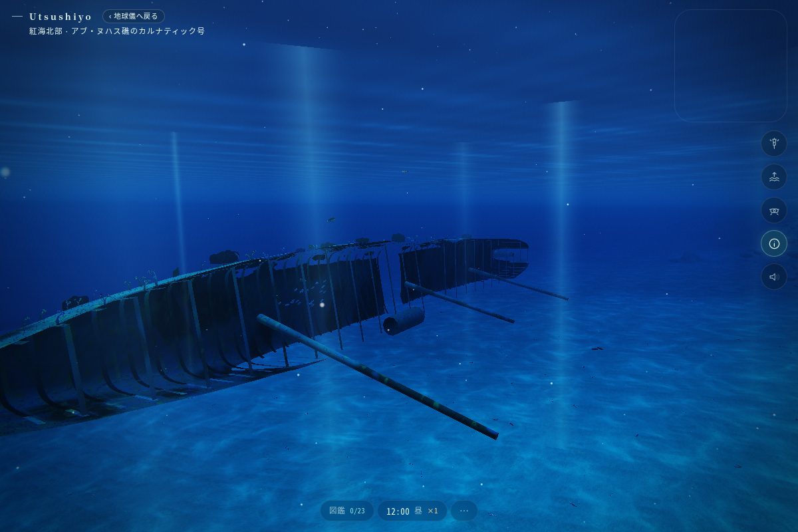
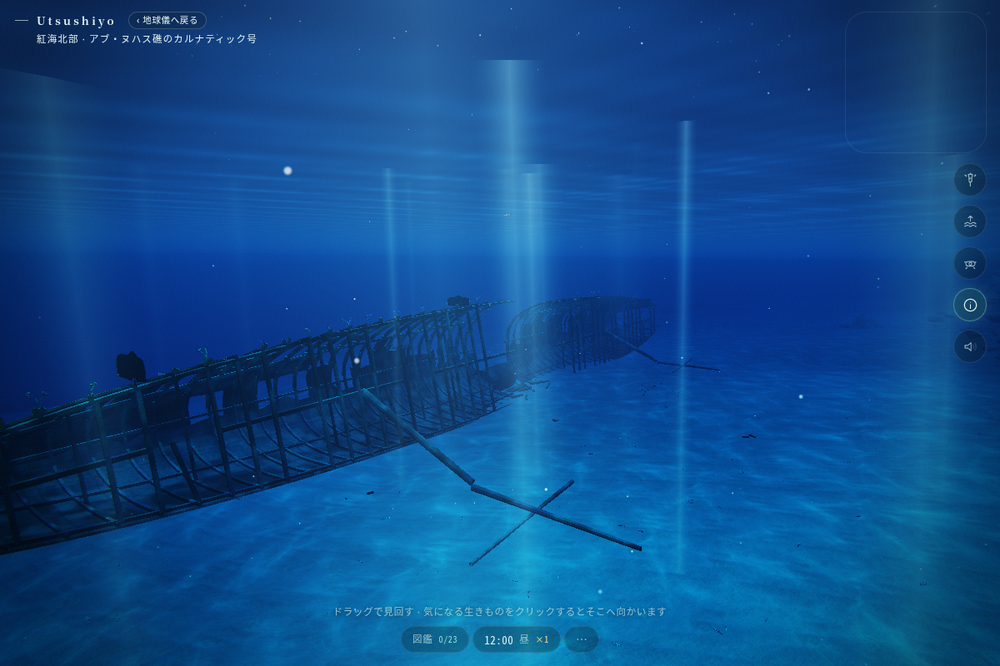
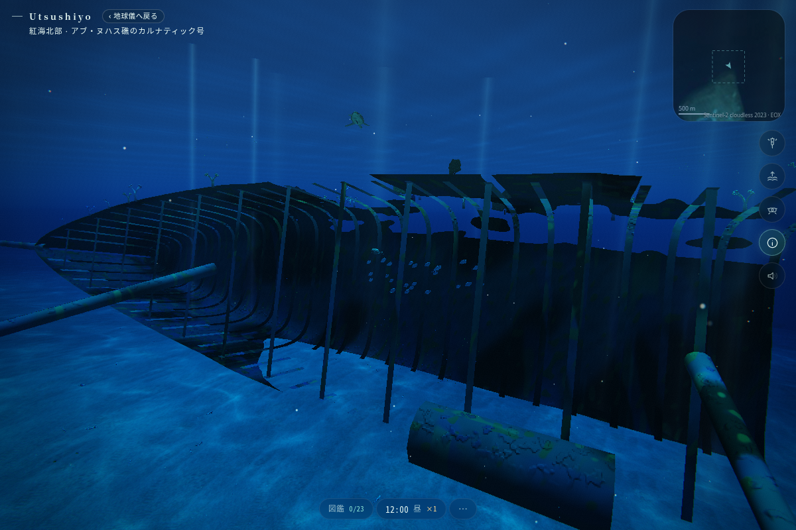
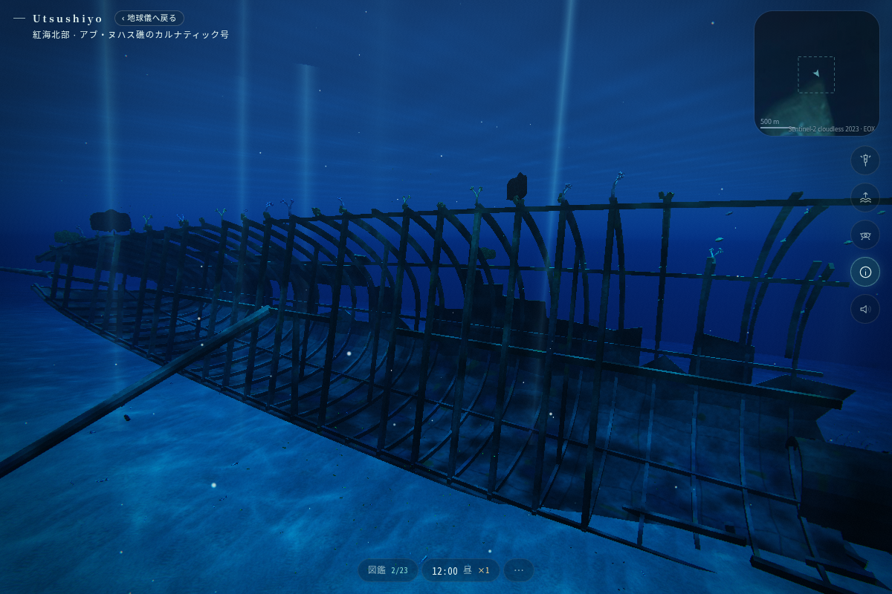
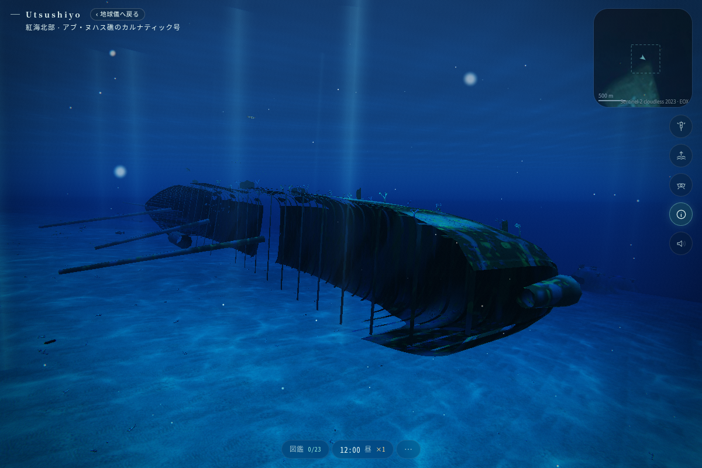
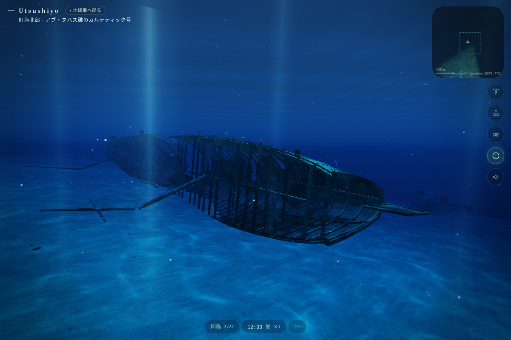

# Astra / Carnatic — 静かな鉄の骨格

**未採択の動く試作です。最終判断・統合・公開は Claude に渡します。**

- 制作指定: **GPT-6 Astra / reasoning ultra**。主要な造形・素材・実装判断をこのモデルが担当。補助 agent は衝突検査とコスト測定を担当。
- ブランチ: `astra/carnatic-wreck-ultra`
- 出発点: `7124cc649a881a805499eb6effa37caa49a92e3d`
- 独立性: 比較対象の前回モデル版の実装・画像は参照せず、この base の画面を見て制作。
- 対象: 既存 `carnatic` / 紅海北部・アブ・ヌハス礁の SS Carnatic。依存・水域・保存形式は追加していない。

人のつくったものが海の時間に戻っていく姿を、驚かせる演出なしに眺める。元の大きな黒い船殻を、**輪郭 → 構造と空洞 → 破損 → 被覆 → 小さな付着生物**の順に読めるようにした。海の色や時間・魚の行動は既存実装を使う。

## 比較画像

同じ指定位置・注視点、1200 × 800、low tier、開始時刻はUTC `2026-06-20T10:00:00Z`（時計は×1で進む）。天候は cloud 0.1 / wind 2。原型は dev、新型は production build + preview の実画面。ドローンの微小な上下動・衝突補正・生態系の動きは動作しており、画素単位で一致する比較ではない。

| 原型 | この試作 |
| --- | --- |
|  |  |
|  |  |
|  |  |

追加: [側面・原型](images/before-broadside.png) / [側面・試作](images/after-broadside.png)、[船首・原型](images/before-bow.png) / [船首・試作](images/after-bow.png)。

最終形状の[ライト近景](images/after-detail-lamp.png)では、低い壺形の海綿の開口、梁の厚み、被覆を確認できる。ライトを点灯した別条件なので、原型との明るさ比較には使わない。撮影日時・読み込んだproduction bundle・実カメラ位置は[5視点の記録](images/after.json)と[近景の記録](images/after-detail.json)に保存した。

| 視点 | 指定位置 | 注視点 |
| --- | --- | --- |
| overview | `[47,-5,-35]` | `[5,-14,-3]` |
| frames | `[8,-11,-20]` | `[19,-14,-3]` |
| stern | `[-50,-12,-18]` | `[-28,-15,-2]` |
| broadside | `[4,-10,-45]` | `[6,-15,1]` |
| bow | `[59,-13,-14]` | `[41,-16,-1]` |
| lamp（ライト点灯） | `[24,-7.9,-12]` | `[26,-8.6,-5.8]` |

## 実装したこと

`src/ocean/wreck.ts` に限定して造形と専用素材を置き換えた。

- 細い船首、絞った船尾、舷弧を持つ断面。前後の断片はそれぞれ一つの基準平面に据え、海底の小さな起伏で船体全体が波打たない。
- 平面のリボンだった肋骨・甲板梁を、矩形断面とフランジのある立体にした。縦通材・部分的な下層甲板梁で奥行きを示す。
- 外板の欠損と中央の破断を実ジオメトリにした。厚い切り口、曲がった肋骨、落ちた梁・板片で断裂をつなぐ。穴のための fragment `discard` は撤去。
- 折れ目のある2本の倒れたマスト状の部材、短いバウスプリット、薄い舵、低い機関残骸を追加。配置や残存状態は推定。
- 灰白の石灰質、陰の鉄、局所的な赤紫・黄の被覆を別のスケールで重ねる。初稿に出た斜めの反復模様は、斜投影の2Dノイズを3D value noiseへ変更して抑えた。
- 低い付着塊と開口した小型海綿を船体と同じメッシュに統合。40か所を既存のソフトコーラル/ウミウチワの配置へ渡す。
- 面の内部まで0.45 m以下の間隔で障害物用の点を採り、0.5 mセルごとの最高点にまとめた。大きな板の角だけ登録して中央を通り抜けることを避ける。

`spot(out)`、`tourStart(rev)`、`tourAt(t,rev,pos,look)`、70秒のツアーを維持。`build.ts`、`locations.ts`、Director、生態系、住民、時計、保存処理は変更していない。造形用の乱数は専用 seed 1869で固定。旧モデルが共有乱数を消費した量とは異なるため、再構築時の周辺サンゴ・魚の初期配置まで原型と一致するわけではない。保存された住民の同一性・記憶を扱うコードには触れていない。

## 事実と推定

これは測量モデルでも、写真から復元したデジタルツインでもない。

| 扱い | 内容 |
| --- | --- |
| 既存データから継承 | 船名 SS Carnatic、アブ・ヌハス礁、1869年の沈没、鉄製の帆走汽船、約90 m × 11.6 m、左舷側へ倒れた破断船体、失われた木甲板。今回、外部史料による再照合はしていない。 |
| 造形上の推定 | 断面・傾き・梁間隔1.62 m・破断位置と隙間・外板の残り方・下層梁・舵とバウスプリット・マストの残存位置・機関部の形。機関部の円筒は構図を支える仮の残骸で、現物の機関配置を表したものではない。 |
| 生物表現上の推定 | 被覆の色と密度、個別の海綿・ウミトサカ・ウミウチワの位置。種の同定や実測の分布ではない。 |
| 未照合 | 現在の現地写真、船体線図、船首/船尾の細部、マストの実際の残存本数・位置、プロペラと機関装置。 |

現地資料に接続できなかった前提を隠さず、Claude が採用する前に年代の分かるダイバー写真・信頼できる船舶資料で照合する。もっともらしい小物を増やして正確さを装うことは避けた。

## 検証

Node 22.23.3、既存 lockfile の `npm ci`、追加 dependency なし。最終 `src/ocean/wreck.ts` のSHA-256は `d95717e65eda8eca01fe43e15f736a05ec5792ccff9871c558e09906a3256f70`。

型検査・build・構造検査はこの最終形状で復旧前に成功している。環境復旧後にソースの一致と保存済みbuildを確認し、同じproduction bundleで5視点とライト近景を再撮影、実ドローン制御の両方向を再検査した。造形・アプリのソースは復旧後に変更していない。

| 確認 | 結果 |
| --- | --- |
| `npm run typecheck` | 成功 |
| `npm run build` | 成功。Vite の既存 `__dirname` / 次期 config loader 警告あり。 |
| `npx tsx --import ./scripts/node-assets.mjs scripts/astra-wreck-check.ts` | 成功。73,396頂点・36,698三角形、有限属性、非縮退面、単位法線と表裏、潜水した境界を検査。 |
| 実 `buildOcean` と衝突 | 3,427障害物点、183,999面内サンプルが実マップに覆われる。40付着点、100 `spot(out)` サンプルが有効。 |
| ツアー | 両方向281サンプル、海底高さに対する鉛直余裕の最小4.20 m、障害物高さマップに対する最小3.00 / 3.52 m。各経路サンプルで実メッシュとの距離0.7 m以上、Director完走も確認。 |
| production browser | Chromium / SwiftShader / low、5視点＋ライト近景。page error 0、採取時のWebGL error 0、context lostなし。画像を開いて目視。外部リソース取得の失敗はこのJS/WebGL判定には含めない。 |
| 実ドローン制御 | browser の `seaglass.stepDrone(1/60)` を両方向4,262ステップずつ実行。両方完走、障害物高さマップに対する鉛直余裕の最小2.997 / 3.483 m、終点差0.033 / 0.033 m。[実測JSON](drone-check.json)。これは制御の早回し検査で、70秒間の描画映像の検査ではない。 |
| `npm run sim -- carnatic` | 昼・夕・夜・朝の既存シミュレーションは成功。最後の海綿形状の微調整前の実行結果で、復旧後は再実行していない。 |

Windows ANGLE / D3D11、Safari、スマートフォン、実GPUでのフレーム時間・長時間運転は未検証。専用シェーダーにテクスチャ取得・早期return・discardを追加していないが、SwiftShaderでの成功をD3D11の保証とはしない。ソフトウェア描画の所要時間は実機FPSとして報告しない。障害物は既存の高さマップなので、船体の空洞を安全に自由潜航できる3D衝突にはなっていない。

## コストと引き継ぎ

正確な計数は [costs.json](costs.json)、判断点と採用手順は [CLAUDE_HANDOFF.md](CLAUDE_HANDOFF.md)。船体+小型付着物は1メッシュ/1素材。40個の既存サンゴは別の既存instancingに合流するため、付着物まで「1 draw」とは言わない。新規テクスチャ・外部モデル・依存はない。

| 計数対象 | 原型 | この試作 |
| --- | ---: | ---: |
| 船体メッシュの頂点 | 5,553 | 73,396 |
| 船体メッシュの三角形（小型付着塊・海綿を含む） | 8,580 | 36,698 |
| 船体の頂点属性＋indexのバイト数 | 251,388 B | 3,376,216 B |
| index形式 | Uint16 | Uint32 |
| 既存サンゴの付着点 | 87（fan 15 / soft 72） | 40（fan 8 / soft 32） |
| 上記サンゴを全個体1回ずつ描く三角形数 | 230,904 | 103,296 |
| 船体＋上記サンゴの三角形数の算術合計 | 239,484 | 139,994 |

船体単体は約4.28倍の三角形と約13.43倍の属性/indexバイト数を使う。一方、既存サンゴの付着数を減らしたため、船体と全付着サンゴを各1回描く算術合計は約41.5%減る。この合計は周囲の海、可視判定、追加描画pass、shader処理を含まず、実GPU速度の比較ではない。バイト数もJSオブジェクト・生成時の一時配列・CPU/GPU双方のコピー・driverの割当を含まない。

`costs.json` は制作時の計測結果と計測手順の記録。細かな属性バイト数と原型/試作の付着サンゴ照合を再生成する一時スクリプトは同梱していない。`astra-wreck-check.ts` で再現できるのはジオメトリ・衝突・付着点・ツアーの検査まで。

再現用の [capture.cjs](capture.cjs) と [drone-check.cjs](drone-check.cjs) は cloud に既にある Playwright / Chromium を利用する補助ツール。アプリの依存ではない。
