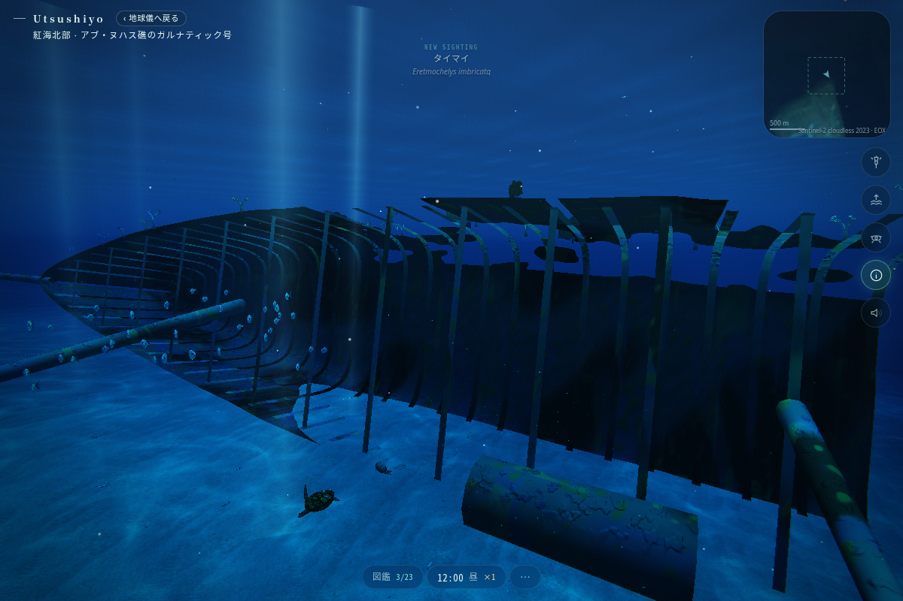
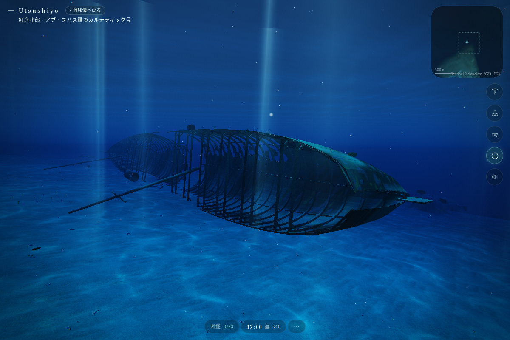

# カルナティック号 — 船体の見え方の改善試作

Claude による最終確認・調整・採用判断のためのブランチ。完成した考証復元ではありません。

- ブランチ: `codex/carnatic-wreck-detail`
- 開始点: `7124cc649a881a805499eb6effa37caa49a92e3d`（main）
- 当初の作業用チェックアウトや main は変更していません。通常の別 clone で作業しました。
- 独立した新海域の試作は `codex/monterey-kelp-prototype`。片方だけでも使えます。
- 引き継ぎ先: [CLAUDE_HANDOFF.md](CLAUDE_HANDOFF.md)

## 見てほしい違い

元の骨組みは薄い両面ポリゴンで、横から見たときに消えたり、船全体が単純な格子に見えたりしました。厚みのある部材、船首の絞り、船尾の丸み、破断部、腐食した外板を組み合わせ、近づいたときも船の構造が読めるようにしています。

| 変更前 | 変更後（同じカメラ位置・向き） |
|---|---|
|  |  |

画像は実装を Chromium / SwiftShader で描画したものです。生成イメージや実船写真ではありません。1200 × 800、low tier、2026-06-20 10:00 UTC。魚・波・鑑賞アニメーションの位相は撮影間で異なります。

## 実装内容

- 左舷を下にした二つの船体は、それぞれ剛体として海底へ配置。地形の起伏に沿って各フレームが別々に曲がる処理を解消。
- 横肋骨・甲板梁・斜めの補強・キール・縦通材を厚みのある形に変更。
- 外板に約 6 cm の厚み。欠落部はジオメトリで開口し、割れ際を不規則にした。fragment discard で開けていた穴は廃止。
- 船首の輪郭、短い船首斜檣、板状の舵、開口した倒れた煙突、中央の少量の鉄材を追加・調整。
- 大きな色斑を抑え、錆・灰褐色の被覆・小さなサンゴに。巨大な装飾が骨組みを隠さないよう調整。
- 図鑑の行き先に「船首の骨組み」「船体の破断部」を追加。
- 魚の `spot()` と 70 秒の往復鑑賞 `tourAt()` の API を保持。

## 実船についての範囲

既存リポジトリの Carnatic 定義（約 90 m × 11.6 m、鉄製帆走汽船、左舷を下にして二分、木製甲板が失われ鉄骨が露出）を基礎にしました。

肋骨間隔・外板厚・補強配置・破断端・舵・倒れた部材の形と現在位置は、見た目を検討するための推定です。材質も手続き的表現です。現在の潜水写真・平面図・測量への位置合わせは実施していません。貨物、財宝、実在しない装飾は加えていません。

確認候補: [SS Carnatic](https://en.wikipedia.org/wiki/SS_Carnatic)、既存の `docs/proposals/wrecks.md`。外部資料へのアクセスはこのクラウドのネットワーク制限で失敗したため、今回新たに閲覧・照合できた出典としては扱っていません。採用前に実船写真と照合してください。

## 確認

- Node 22.23.3: `npm run typecheck`、`npm run build` 成功。
- `npx tsx --import ./scripts/node-assets.mjs scripts/wreck-check.ts` 成功。全属性の有限値、index 範囲、法線、ランドマーク、前進・後進の全鑑賞ルートを検査。
- 43731 頂点 / 37572 三角形 / サンゴ配置候補 31 点。従来は 5553 頂点。船体は引き続き 1 draw call、サンゴは既存の instancing。
- 鑑賞路の障害物上端との最小余裕は約 1.75 m（0.25 秒刻み）。
- `npm run sim -- carnatic` の昼・夕・夜・朝を実行、完走。
- production preview を Chromium 151 / SwiftShader で描画。3 視点で確認、JS / shader エラー、WebGL context loss、`gl.getError()` エラーなし。
- 既存の Vite の `__dirname` 将来互換警告は残っています。

未検証: Windows / D3D11、iOS Safari、実 GPU の FPS、長時間滞在、実船との厳密な考証。

衝突は既存の高さマップです。見える穴が開いても、内部への潜り込みが正確にできるわけではありません。通り抜け可能な船内探索を実装したとは扱わないでください。住民・保存キー・保存形式への変更はありませんが、端末をまたぐ保存の実地検証は行っていません。
