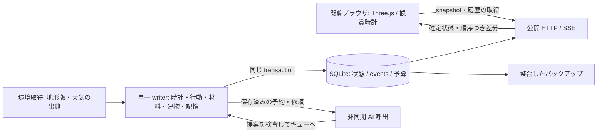

# 一つの世界を、失わずに育てる基盤

状態：設計提案。アプリ・サーバー・採択済み ADR は変更していない。調査基点は `9b5a40f`。
型・識別子・不変条件の正本は [CONTRACTS.md](CONTRACTS.md)。本書は実行順序、保存、配信、移行を定める。

## 1. 決まった方向と、今回提案する変更

**誰もが同じ島・同じ住民・同じ歴史を眺める**ことは今回のユーザー決定。人数分の世界を作らない。
国内 VPS を使う方針と AI 全体の月額上限 15,000 円は、既存の開発ガイドと世界サーバー案を引き継ぐ。
エックスサーバー VPS を第一候補、さくらの VPS を次点とし、別のクラウド事業者への変更は提案しない。
契約中の共用レンタルサーバーと、常時 Node を動かす VPS は区別する。VPS の契約・配置は本書では実行しない。

既存 [世界サーバー案](../ai-world-server/README.md) を出発点に、次の点を具体化・修正する。

| 既存文書・実装 | この設計で提案する扱い |
|---|---|
| 切断中はブラウザの暮らしを進める | 共有モードでは最終受信状態を閲覧する。独自の歴史を作り、後から混ぜない |
| `residents.ts` は地形ローダーと保存先を替えればよい | 描画・DOM・物品・時計の結合を段階的に抽出する。現状は完成したサーバーコアではない |
| 1 日 150〜200 円／体 | 活発な日の配分目安。4 体に毎日保証すると月額上限と矛盾するため、月額から配分する |
| 始めた会話は自然な終わりまで | 場面全体の費用を先に予約する。予約内で終える設計にし、月額を越えて延長しない |
| 末尾に Fly.io 推奨・共有世界を再質問 | 文中の国内 VPS 方針と今回の共有世界決定を優先。再選定・再確認の前提にしない |

採用時は ADR 0001 の「ブラウザ正本」「訪問時の最大 12 時間追いつき」「共有世界は後回し」を新 ADR で置き換える。
時刻と描画の分離、LLM 失敗時の規則行動、既存保存を黙って消さない原則は継続する。

## 2. 最初は一つの Node プロセスと SQLite

TypeScript の純粋な世界コア、Node の実行アダプター、既存 Three.js の表示を同じリポジトリで管理する。
SQLite は永続ディスク上で WAL を使い、世界を書き換えるコードを一つのキューへ集約する。
HTTP 接続ごと、SSE 購読ごと、AI の応答コールバックごとには世界を進めない。
閲覧者 0 人でも同じ時計で進む。100 人が開いても 100 倍動かず、AI の依頼数も増えない。
並列に別 writer を起動できないプロセス管理・排他を置く。SQLite のロックだけでは二つのスケジューラーを防げない。
初期構成は単一ホストなので停止期間はあり得る。高可用性を約束する構成ではない。

## 3. 何を正本にするか

| サーバーが確定するもの | ブラウザで再現・調整できるもの |
|---|---|
| 住民 ID、位置、体力、行動、実行済み作業、関係、記憶 | 補間した姿勢、足運び、表情、吹き出しの配置 |
| 物品 ID、材料量、保管場所、耐久、予約、加工・消費・回収 | 流木の細かな凹凸、木屑、影、手から部材へ動く演出 |
| 作品の版、全設置部品、接合、機能の検証結果、利用記録 | instancing、LOD、遠景省略、表示密度、材質・画質 |
| 住民の判断に用いた環境値・出典・適用時刻 | 観賞用の季節、明るさ、カメラ、海面の見せ方 |
| 採集に使える生物資源・植物・漂着物の在庫と供給 | 鑑賞用魚群や遠景植生の個体配置・揺れ |

表示密度を下げても材料は減らず、高画質にしても拾える木が増えない。
生態系全体の全個体を初日からサーバー化する必要はない。採集・加工・建築の原因になる資源は、正本の ID と供給規則を持たせる。
見た目だけの魚を食べてサーバー在庫を増やす接続はしない。既存生態系を創造活動に接続する段階で資源層との契約を追加する。
嵐による損耗はサーバーの環境と機能規則から計算する。閲覧者の雨ボタンや端末ごとの天気取得では壊さない。

## 4. 時計と環境の来歴

世界の日付は現実の UTC 時刻、生活・予算の日付境界は `Asia/Tokyo` を初期設定とする。
経過時間には単調時計を使い、壁時計の逆行や大きな補正を検知したら実行を保留する。実行済み作業を巻き戻したり二度数えたりしない。
通常は一秒分を上限 250 ms の小刻みな移動計算に分け、確定フレームを一 transaction で保存してから公開する初期案とする。
描画は端末のフレームレートで補間する。補間の完了やアニメーションの終了を、世界の作業完了には使わない。
周期・保存量は実測で調整するが、**未保存の進捗を確定した歴史として配信しない**境界は維持する。

世界で使う天気はサーバーが一度取得し、`environmentSampleId`、`source`、`effectiveAt`、取得時刻、有効期限、値、提供元を保存する。
現地データも提供元による推定・観測範囲がある。住民自身が測定した事実とは区別する。
失敗時の標準天気は `simulation`、期限切れの既知値は `stale`、値がなければ `unknown` と扱い、実測として記録しない。
雨が必要な試験、強風下での作業、星の視認などは、有効な条件がない場合に保留できる。晴れと決めつけて合格させない。
潮や太陽位置など計算可能な値にも計算法・版を付ける。観察・損耗イベントは参照した環境 ID を持つ。

## 5. 一つの変更が確定するまで

`worldId` は世界の同一性、`worldEpoch` は復旧等で分岐した履歴の世代、`worldVersion` は世代内の確定イベント連番。
`siteVersion` は工事区域の状態、`navVersion` は通行可能性の版。無関係な住民の移動だけで設計提案を全棄却しない。
`projectRevisionId` と `blueprintRevisionId` を分け、企画の理由・段階と、部品配置・接合の設計を混同しない。

1. 観察から、参照版つきの判断候補を作る。AI は許された候補・部品・操作で提案する。
2. `commandId` の重複を照合し、現時点の材料、場所、機能、設計版、動作能力を検査する。
3. 短い SQLite transaction 内で、必要な材料予約と `actionLease`、`actionId`、採用イベント、投影状態を同時に確定する。
4. サーバーの実行器が移動・到達・保持・工具・作業時間を進める。必要条件が失われたら停止・再計画する。
5. 完了直前にも版と条件を再検査する。加工／設置・材料移転・機能検査・記憶の根拠を同じ transaction で確定する。
6. COMMIT 後にだけ配信する。AI の文章「屋根を作った」や予定時刻の到来だけでは部品を出現させない。

transaction 内で HTTP や LLM を待たない。非同期応答はキューへ戻し、期限・元の依頼・現在の版を確認する。
古い提案は理由つきで破棄するか、現在の状態で再検証して採用する。作業中の手を、届いた文章で突然差し替えない。
同一 `commandId` は同じ結果を返す。異なる payload での再利用は拒否する。再送で部材や使用料を二重に増減させない。

## 6. 材料、工事区域、通路を一緒に守る

材料台帳は「どの現物／ロットが、どこに、何単位あり、誰の作業に予約されているか」を持つ。
数量は素材ごとに決めた整数単位で扱う。加工は入力→部品＋端材＋損失の変換として保存し、解体は回収率と劣化を反映する。
無限に材料が湧く補充ではなく、漂着・成長などの供給イベントに理由と上限を持たせる。
設置部品は材料・加工・運搬の履歴へ遡れる。新しい材料でもないのに、再読み込みで ID を振り直さない。

`actionLease` は一人の作業権と必要な予約を短期間押さえる。更新はサーバーの実行器が行い、閲覧者の接続とは無関係。
睡眠・会話・雨・経路閉塞・再起動では、進捗を保存し `paused` と `resumeStage` へ移せる。
期限切れで解放するのは未使用の予約であり、運搬済みの物や加工済みの部品を元の素材へ戻さない。
途中の工作物、手元の荷物、現場に置いた資材を残し、再開時に場所と版を再検査する。

部品設置の占有範囲・接合・支持条件に加え、出入口、住民の現在位置、作業位置への通路を検査する。
通路を変える設置／撤去は `siteVersion` と `navVersion` を更新し、影響する経路を無効化する。
経路がなくなった場合に目的地まで直線歩行で代用しない。停止→迂回検査→できなければ工事を保留する。
複数住民の共同制作も、各 `actionId` の完了と材料移転を積み上げる。全員の到着予定からまとめて完成させない。

## 7. 保存の単位と再現性

| 論理テーブル群 | 保持するもの |
|---|---|
| world / residents / actions | 世代・時計・版、身体状態、実行進捗、リース、停止理由 |
| projects / blueprint revisions / parts | 企画の版、設計の版、全設置部品、接合、耐久、機能検証の根拠 |
| resources / material ledger | 現在量、所在、予約、由来、変換・消費・回収の記録 |
| incidents / impact reservations | 原因と規則版、被害/回収不能量、回復資源、未解決枠、保護区分、解決と冷却期限 |
| process definitions / runs / research / energy ledger | 工程と評価器の版、試作の投入/進捗/生成、知覚された結果、習得範囲、供給/蓄積/消費/損失 |
| events / command results | 連番・transaction 範囲、時刻、因果、対象、採用済みの変更、重複排除 |
| environment / memories / use records | 環境の出典、住民が経験した事実、作品を使った結果 |
| snapshots / asset manifests | ある確定版の全状態、schema・地形・規則・部品カタログの版／ハッシュ |
| AI jobs / budget reservations / usage | 依頼・応答の状態、予約額、実費、課金不明分、利用目的 |

イベントには `worldVersion`、世界時刻、記録時刻、発生理由、対象 ID、適用する具体的な変更を入れる。
設置・移動・修繕・撤去した**全ての部品変更**を時刻つきで記録する。工程の再生ではその時点の部品集合を復元できる。
機能は設置部品・接合・環境から世界が判定する。検証規則の版と根拠も保存し、AI が任意に「雨を完全に防ぐ」と設定できない。
作品を読み込む際は parts と検証済み affordances を復元する。メッシュだけ保存して機能を失う形式にしない。

復旧は「snapshot ＋その後の確定 events」を順に適用する。過去の LLM や乱数を再実行して似た結果を作らない。
将来の規則行動には専用 seed と生成器の版を持つ。採用した乱数結果・外部入力はイベントへ具体値として残す。
見た目の乱数は別系列。描画密度、フレームレート、同時閲覧者数を変えても将来の材料供給が変わらない。
snapshot は確定連番と整合検査値を持ち、途中書込みを公開しない。schema 移行前に元データを保全し、移行後も同一性を照合する。

[事故と回復](ADVERSITY_AND_RECOVERY.md) も同じ単一writerで検査・確定する。未解決枠と最小回復資源の確保を原子的に処理し、被害・部品・動線・機能の途中状態を配信しない。猶予の開始時刻、未解決件数、損失履歴、冷却期限を永続化し、再起動で再抽選や枠の再取得を起こさない。既存AI予算とは別の「被害の許容範囲」であり、別サーバーや別の課金枠は作らない。

[科学工程](SCIENCE_AND_CIVILIZATION.md) も同じ正本で実行し、工程カタログの実行可否・評価器版を保存する。AIが未知の反応や数値を追加する入口にしない。処理中の燃料・温度履歴・電力供給は世界の時間区間で進め、工程の投入/生成とエネルギーの区間を再送で二重計上しない。停止期間の未知の熱履歴を埋めず、運用上の中断を世界内の加工失敗から分ける。具体的な積分とチェックポイントは科学工程の実装前に定義・試験する。
高頻度の姿勢・位置記録は圧縮・期間保管できるが、部品・資源・意思決定・使用結果の履歴は日次アーカイブで残す。
過去の詳細な足取りを保管しない期間は、再生 UI で工程を再現していることを区別する。

## 8. 配信、切断、世界を眺めるための再生

初期は HTTP snapshot と一方向 SSE。現在状態を約一秒間隔で配り、変更のない長文日記・作品全文は別取得する。
snapshot は `worldId / worldEpoch / worldVersion / serverTime / schemaVersion` を含む。
SSE は transaction ごとに `fromVersion / toVersion` とイベント集合を渡す。ブラウザは全体を適用してから表示版を進める。
初回 snapshot の版より後のイベントを要求できるようにし、snapshot 取得と接続の隙間で変更を落とさない。
重複は無視、順番違い・欠番・保持期間外は resync。`Last-Event-ID` の再接続だけに頼らず、連続性を検証する。
epoch が変わったら古い差分と補間を破棄し、全体を再取得する。世代をまたいだ連番比較をしない。

切断時は最終同期時刻を示す。短い移動補間が終わったら位置を止め、呼吸など表示だけ続けられる。
端末は新しい採集・完成・会話・AI 呼出を行わない。再接続時はサーバー正本に戻り、ローカル進行を混ぜない。
古いブラウザのセーブは別名の個人記録として閲覧可能にできるが、共有世界への自動アップロードはしない。
観賞時計や建築過程の再生は読取り専用。過去を眺めても実世界の住民や予算は巻き戻らない。
大量の閲覧者には同じ配信用 payload を共有し、遅い接続は切って snapshot へ誘導する。閲覧人数の上限は負荷試験で決める。

## 9. サーバーが止まったとき

閲覧者が不在なだけなら通常進行。サーバー停止は別の事象として、最終確定時刻と復旧時刻の空白を記録する。
短い中断でも先に確定状態を復元し、実行中の工事・AI 通信・予約を点検する。期限が過ぎただけで工事を完成させない。
初期の追いつき対象は睡眠・休息など、材料や地形を変えず、保存済み条件だけで扱える状態に限定する。
上限は設定可能な最大 12 時間とし、それ以上の空白は圧縮した停止期間として明示する。負荷に応じた計算量上限も設ける。
追いつきによる推定は履歴に明記し、その間に新しい建設・採集・会話・観察を実行したことにはしない。
未取得の過去の雨や嵐を作らず、現在の天気で停止期間全体の損耗を算出しない。未知の影響は保留する。
LLM の不在分を一斉発注しない。復旧後の通常枠で、未完了の問いと工事から再開する。

停止・保存不具合・API障害を、住民が物を失う物語上の事故へ変換しない。運用上の復旧とその出所を記録する。事故からの最低限の回収・休息は規則で進められるようにし、API停止や予算終了で回復不能にならないことを導入条件とする。

## 10. AI を呼ぶ場所と、月額を守る台帳

AI は新しい目的、設計案、行き詰まり、試用後の改修、会話、振り返りの節目で呼ぶ。
歩行・一打ごとの加工・設置判定・耐久減少・毎フレームの制御は規則で実行する。
創造活動の予算は既存の判断・会話・内省と同じ **月額 15,000 円の枠内**。別枠で上乗せしない。
平均配分は 30 日月なら全体 500 円／日、4 体均等なら 125 円／体／日。31 日月はさらに小さくなる。
150〜200 円／体の日があっても、他の日・用途との配分で収める。静かな日には考える義務を設けない。

呼出前に最大入力・最大出力・キャッシュ書込等の費用を保守的に見積もり、`budgetReservationId` を transaction で取得する。
許可条件は「月内の確定実費＋未決済予約＋課金不明分＋新規の最大費用」が運用上限以内であること。
為替・税等の余裕を含めた運用上限を月額 15,000 円より低く設定し、金額は固定小数点で扱う。キャッシュ割引を先取りしない。
モデル ID・単価・換算条件は配備時に公式資料で確認して設定化する。既存案のモデル名・価格表を検証済み料金として転記しない。

会話・内省は最大ターンと最大トークンを持つ場面全体を予約し、各呼出の実費を同じ場面から精算する。
残額が少なくなったら自然な締めへ誘導し、上限では規則の終了表現へ移る。無制限に「自然な終わり」を待たない。
月をまたぐ可能性がある場面は、次月に送る分の枠も確保するか、現月中に閉じる。課金月を過去月へ付け替えない。
利用プロバイダー側の請求期間・通貨との差分も照合し、実際の請求が台帳の換算値と同額だとは仮定しない。

予約→送信予定の保存→送信→使用量の精算を分離する。タイムアウトやプロセス停止で課金が不明なら予約を戻さない。
外部 API の「厳密に一度だけの送達」は保証しない。送信済みか不明な依頼を自動再送せず、新しい試行にも別の最大額を確保する。
`inflight` は再起動後に `unknown` とし、提供元の使用量と照合できるまで保守的に保持する。
API 失敗や予算終了でも身体行動は続く。検査に落ちた設計を採用して取り繕わず、使える既存計画・休息・観察へ戻る。

## 11. バックアップ、復旧と運用の見える化

SQLite のオンラインバックアップ等で整合した DB と参照アセットの manifest を日次保存する。稼働中の DB 本体だけのコピーは避ける。
同一 VPS の故障に備え、契約中の保存先等へ別コピーを置く。世代・復元対象・保存期間を運用設定に記録する。
日次だけなら最大一日分を失い得る。短い間隔の差分退避が必要かは、テスト週の容量と回復目標から決める。
復元訓練では、部品数・材料収支・住民 ID・最新イベント・未完了工事・予算を照合する。復元できたことまで確認する。
古いバックアップへ戻す場合は新しい `worldEpoch` にし、失われた期間を明示する。AI は停止した状態で復旧する。
AI 費用はバックアップ以降も請求され得るため、外部使用量と照合するか失われた期間の枠を消費済みとして保守的に確保する。
世界の履歴を戻しても請求済み金額は戻らない。予算台帳を巻き戻したまま呼出を再開しない。

オーナーが見る項目は、最後の確定時刻、tick 遅延、保存失敗、工事の停止理由、材料収支、AI 待機数、実費・予約・不明額、バックアップ日時。
生存確認と readiness を分ける。DB 不整合、地形版の欠落、復旧処理中は配信できても世界を進める準備は完了していない。
ディスク書込に失敗したら世界の確定と AI 新規送信を止め、最後の確定状態を表示する。メモリだけで暮らしを続けて保存済みに見せない。
API キーは VPS の実行設定のみ。公開 API は読取り専用、運営の停止・再開・復元操作は認証した別経路にする。
外部資料や訪問者の文章は引用データとして扱い、実行命令にしない。AI に shell・SQL・任意コード・未許可の外部発信を渡さない。
住民の文章は安全なテキストとして表示し、作品ファイルは許された形式から生成する。ログにキーや無制限の生応答を残さない。

## 12. 現在のコードから段階的に移す

現状の `residents.ts` には Three.js 材質・モデル・小屋の transform・作業判定・DOM・localStorage・乱数が同居する。
Node 用チェックも `document` と localStorage をスタブし、Three.js を使っている。サーバー分離が済んだ証拠にはならない。
`items.ts` は生成・予約・回収と InstancedMesh が一体で、保存時に物品 ID・予約を維持しない。
`land.ts` は PNG の canvas 読取と Texture 作成が一体。`main.ts` は通常モードで観賞時計を住民へ渡している。

| 段階 | 抽出する境界 | 次へ進むための確認 |
|---|---|---|
| G0. 時計・入出力・事実 | 時計、保存、環境、乱数、地形の adapter と JSON 状態を抽出。Three 表示を分離 | DOM・localStorage・GPU なしで到達・加工・設置が動き、保存後も同じ材料と履歴。観賞時計の影響なし |
| G1. 一つの場所で縦断 | 閉じたテスト世界で材料→制作→機能→試用→規則による改修をつなぐ | 異なる表示でも使用結果と材料収支が一致。共有本番へ実験の履歴を混ぜない |
| G2. 共有世界の正本 | SQLite、単一 writer、snapshot/SSE、既存履歴の移行、費用台帳と送信ゲート。AIは模擬通信で検査し、実送信は無効 | 複数タブ・再接続・再起動でも一つの歴史。viewer 0 人でも継続。規則による共有公開を検討 |
| G3. AI と長期運用 | 実AIを有効にし、節目の提案、経験に基づく改修、長期観察を行う | 実 API のテスト週で費用・面白さ・停止復旧を確認 |

G1 の動作検証と、Claude が担当する G2 のサーバー土台は、状態・操作契約を先に揃えて並行できる。
G1 のローカル実験は独立した `worldId` を使い、共有モードの切断時フォールバックとして起動しない。

旧 localStorage は読取り専用の移行候補として扱う。オーナーが選んだ一つを監査付きで初期世界にするか、新規開始するかを切替時に決める。
全訪問者の保存を集めて合成しない。由来不明の旧所持品や建物は `legacy` の初期状態として記録し、過去の加工履歴を創作しない。
新旧の行動器を同じ住民に同時実行しない。実装は独立 branch で検証し、Claude のレビュー後に共有モードを切り替える。

島と周囲の海の拡張では、静的地形を版つきタイルに分け、島の建築・経路に必要な範囲をサーバーで読む。
遠くの海の描画範囲が広がることと、全個体の世界シミュレーションを増やすことは別に計測する。
将来の別地域もまず同じ writer の `regionId` で増やし、部材・住民の移動をイベントとして扱う。
地域別サーバーへの分割は、計測した tick・DB・配信の限界が理由になった段階で検討する。初日から分散トランザクションを導入しない。
同時 1,000 人対応、復旧時間、長期保存容量は本設計だけでは保証しない。実装後の負荷・障害・復元試験で確認する。
