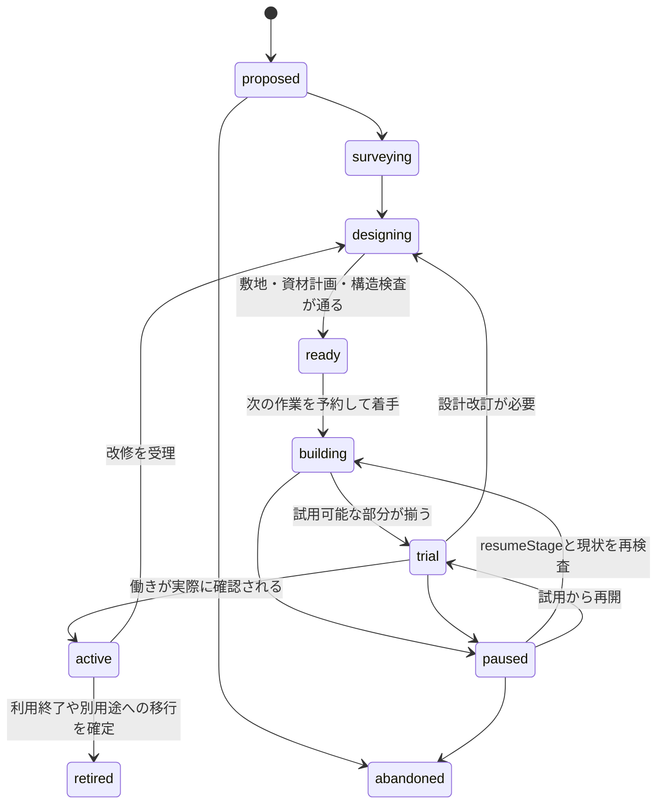

# 世界内の創作：状態と操作の契約案

状態：**未採択の設計**。実装済み API や保存形式ではない。語彙・不変条件を各設計書で揃えるための正本。TypeScript の型、SQLite の制約、JSON 検査は実装時にここから作る。既存 `seaglass.*` 保存形式をこの文書だけで変更しない。

## 1. 世界の正本

全員が同じ `worldId` を閲覧する。ブラウザを開く人数は住民の速度、材料の補充、AI 判断回数を変えない。保存した作品は描画メッシュではなく、部品・接続・位置・使用可能な働きの根拠を持つ。

| 名称 | 意味・規則 |
|---|---|
| `worldId` | 一つの共有世界。初期は一つ。別の実験は別 ID |
| `worldEpoch` | 復旧・巻き戻しなど、履歴の連続性が変わったときに更新する識別子 |
| `worldVersion` | 確定した世界イベントの連番。同じ epoch 内で単調増加 |
| `worldTime` | サーバーが管理する現実の UTC 時刻。観賞用プリセットと独立 |
| `siteVersion` / `navVersion` | 敷地と移動可能領域の版。設置・撤去の前提を再検査するためのもの |
| `catalogVersion` | 部材・接続規則・機能・材料換算の定義版。旧作品の再現に必要 |
| `environmentSampleId` | 工事・利用・劣化が参照した天候等の記録 ID。`source` と `effectiveAt` を持つ |

`worldVersion` が増えただけで全提案を破棄しない。対象の敷地・資材・計画・身体の版を比較し、関係する前提が変わった場合に再検査する。古い epoch の操作は受理しない。

### 座標と時間

- 島の位置はメートル。建築は検査済み敷地のローカル座標系に置く。
- 初期案は **25cm の部材グリッド**、部品の水平回転は 90 度単位。敷地全体の向きは世界が地形・動線から検査した候補を使う。島の地形や既存生物を立方体にはしない。
- 接続点は部材カタログに定義し、グリッド外の厚みや装飾は見た目で表現できる。接続可能範囲は見た目から推定しない。
- 世界の長期履歴は UTC。UI は現地時刻を表示。月次費用の境界は運用設定で固定し、初期案は JST。
- フレームの経過時間、世界の時刻、工事の実行時間を別に扱う。時計を夜にしても工事は進まない。

## 2. 保存する実体

以下は必要な意味の定義であり、DB テーブルを一つずつ作る指示ではない。

| 実体 | 最小情報 | 所有者 |
|---|---|---|
| `Resident` | 永続 ID、身体能力、実位置、現在の行為、電池等、関心・記憶参照 | 世界 |
| `Site` | ID、地形版、配置可能範囲、搬入・退避点、通行/生息域、容量 | 世界 |
| `MaterialLot` | ID、材料種、単位付き数量、品質、出所イベント、保管先、版 | 世界の資材台帳 |
| `Project` | ID、作者/参加者、動機の証拠、段階、再開段階、期限ではなく次の見直し時点 | 世界 |
| `ProjectRevision` | ID、projectId、対象 Work、計画の目的・評価条件・作業 DAG | 世界が受理した計画 |
| `BlueprintRevision` | ID、catalogVersion、部品グラフ・接続・候補敷地、前版 ID | 世界が検査した設計 |
| `Work` | ID、実在する部品 ID 群、現行設計参照、作者/協力者、用途の評価、履歴参照 | 世界 |
| `PartInstance` | ID、カタログ項目、実姿勢、接続、資材出所、耐久、占有空間、版 | 世界 |
| `Action` | ID、住民、対象、開始条件、必要能力、時間、進行、結果、lease | 実行器 |
| `UseSession` | ID、誰が何の働きをいつ使い、何秒使えたか、障害/中断、環境参照 | 世界の利用記録 |
| `Memory` | 本人が知るイベント参照、気づき/解釈、重要度、未解決の問い、見直し履歴 | 本人の記憶 |
| `Incident` | ID、原因/環境参照、規則版、対象、直接/派生影響、段階、解決条件、冷却期限 | 世界 |
| `ImpactReservation` | 事故前の素材別残高、許容損失、回復工数、保護対象検査、最小回復資源の確保 | 世界の事故検査器 |

計画した部品と、完成して実在する部品を混ぜない。未施工の屋根は雨を遮らない。完成予定図は別の表示であり、移動や物理効果の対象ではない。

初期の32部品上限は、一つの新規Workに現存する施工部品の合計。改修中の旧部品・新部品・仮支えを含み、設計版ごとに枠を取り直さない。撤去して回収材になった物は施工部品から外すが、在庫と敷地の占有には残る。仮置き材料の容量も敷地ごとに別途検査する。

`MaterialLot` の保管先は `source / ground / storage / resident / installed / waste` 等の管理された所在。予約は所在ではなく、そのロットの利用権を確保する別レコード。個数・長さ・重量を混ぜず、品目ごとに整数の最小単位を決める。

傷みは品質/耐久、流されたことは所在の変化として持つ。回収可能な漂流物は実在する所在に残す。回収不能を確定した量は `unrecoverable` の終端台帳へ移し、利用可能な在庫には数えない。元ロット・原因・単位付き数量を残し、所在不明や一時的な回収困難と区別する。

### 計画と作品の寿命



図は代表的な経路。`surveying / designing / ready` も `paused` に移せ、元の `resumeStage` に再検査して戻れる。着工前の計画中止は `abandoned`。着工済み計画を中止しても部品は消さず、足場・資材を安全に残すか撤去する作業を別途行う。

改修を受理したら、同じ Project に新しい `ProjectRevision` を追加し、`active → designing` へ戻る。新しい `BlueprintRevision` の検査・施工・試用を経て再び `active` になる。既存 Work は維持し、既存部品は実際に外すまで存在する。用途は計画段階と別に評価し、安全に使える部分は維持する。

`active` は固定の永遠の完成ではない。試用条件を満たす、直す、使われなくなる、残しておく、転用するという経緯を持てる。`retired` は利用計画から退くことを表し、物理的な撤去とは別。残す部品と占有・用途は明示し、状態名だけで作品を消さない。

## 3. AI の提案と世界の確定を分ける

AI に渡せるのは、本人が知ること、未完成の計画、能力、候補敷地/操作/部材、残りの計画予算。部品一つごとには呼ばない。

提案の意味を示す例（wire API は未実装）：

```json
{
  "kind": "propose_revision",
  "worldId": "utsushiyo-main",
  "worldEpoch": "epoch-1",
  "observedWorldVersion": 420,
  "residentId": "dot",
  "projectId": "project-workplace-1",
  "baseProjectRevisionId": "project-rev-1",
  "siteCandidateId": "clearing-a",
  "knownEventIds": ["event-rain-interruption-1"],
  "goal": "手帖を乾いた台に置き、空も見上げられる場所を作る",
  "designIntent": {
    "requiredFunctions": ["supportSurface", "rainShelter"],
    "keepOpenSkyZone": true,
    "partGraphCandidateId": "candidate-2"
  }
}
```

初期は候補を列挙する設計生成器が、合法な部材と許容パラメータから複数の部品グラフを作る。AI は敷地、配置関係、用途、好みを選び、次の段階でグラフ編集提案まで広げる。完成形一種類の色替えだけにはしない。少なくとも敷地・作業面の位置・屋根と開空間の関係に、実際に違いが出る組み合わせを用意する。

上の例は問いや目的を通す形式であり、任意の日本語 `goal` を読んで物理効果を発生させるものではない。`knownEventIds` はサーバーが渡した範囲と照合する。AI はサーバー時刻、実行完了、耐久、資材数量、機能の有効フラグを設定できない。

### 行為を一つ確定するまで

1. 計画から、今できる次の作業を実行器が選ぶ。住民の睡眠・食事・会話・既存の約束と調整する。
2. `commandId` による重複検査、actor 能力、対象版、敷地、材料、接続、支え、衝突、搬入/退避経路を検査する。
3. 次の作業に必要な材料・設置区画を短期間予約し `actionLease` を発行する。計画全部を無期限に占有しない。
4. 住民が実際に取りに行き、運び、届く位置で作業する。材料の持ち替えも確定操作。時間が経っただけで瞬間移動しない。
5. 完了直前に必要な版と条件を再検査する。場所、資材、姿勢が変わっていたら保留/再計画し、成功を記録しない。
6. 一つの DB transaction で、資材の移動/消費、部品変更、占有と経路版、用途評価、Action 結果、出来事を確定する。
7. 確定した一つの結果を描画・記憶・他の住民の知覚へ配信する。効果音や部材のアニメーションが正本を決めることはない。

設置・接続・除去・加工・回収・保管・利用開始/終了は、それぞれ検査済み command。AI が作った JavaScript、SQL、任意の mesh、シェーダー、URL を実行する入口にしない。

## 4. 機能は世界が証明する

最初の用語は `supportSurface`（物を置いて作業できる面）、`rainShelter`（雨を避けられる空間）、`restSeat`（身体に合い実際に使える席）。`storage`・`walkableDeck`・道・楽器は後続段階。

| 機能 | 有効にする根拠 | 観察できる結果 |
|---|---|---|
| `supportSurface` | 支え・作業面積・傾き・高さ・接近点を検査 | 対応する制作作業がそこで実行できる |
| `rainShelter` | 施工済み屋根の鉛直方向の被覆、支え、作業点、出入口を検査 | 記録された雨の下で制作を続けられる。横殴りの雨は後段 |
| `restSeat` | 支持・空間・身体寸法・空席を検査 | 座る/休む行動の候補になる |
| `storage` | 容量・アクセス・予約・保管物の所在を検査 | 在庫の移動と取り出しが実際に成立する |
| `walkableDeck` | 支え・接続・通行幅・床面を検査 | 移動可能領域に加わり、経路が変わる |

判定結果には、部品/敷地の版、評価器の版、使用条件を残す。壊れたり外したりした部品に依存する機能は同じ確定処理で無効化する。道の速さ等は後段の明示ルールであり、設置しただけで何でも万能に改善する効果にはしない。

「雨を避けられた」は条件付きの実行事実。「居心地がよい」「きれい」は本人の解釈。両方を残すが、解釈を構造検査の代わりにしない。物理規則はゲーム内の簡略モデルであり、現実の建築安全性の証明ではない。

## 5. 資源・故障・復旧の不変条件

1. 資源流入＋初期残高＝所在別の残高（再利用可能な廃材を含む）＋記録済みの不可逆な加工損耗＋事故等の回収不能量。各項は重複させず、事故に伴う加工損耗も一度だけ計上する。予約しても数量は増えない。
2. 同じロットを同時に二人へ払い出さない。残量不足なら作業を待つ/別案にする。
3. 加工は入力と出力の単位・数量を版付きレシピで結ぶ。撤去で得られる再利用材も決めた歩留まりに従う。
4. 作業中断後も手に持つ物・実在部品は残る。lease が切れたら未使用の予約を解放し、持ち物を複製して倉庫へ戻さない。
5. 支えの除去は依存する部品と使用中の住民を検査する。危険なら先に退避・仮支え・別手順を必要とする。
6. 摩耗は経過時間・実際の使用・保存済み環境条件から計算し、二重適用しない。天候不明の停止期間に嵐の損傷を創作しない。
7. 同じ `commandId` の再送は元の結果を返す。世界への変更は高々一回。古い epoch の命令は拒否する。
8. 起動時に未完了 Action を完了扱いにしない。材料と部品の所在、作業進行を読み、検査して再開/中断する。
9. バックアップ復旧で世界を巻き戻したら epoch を変える。AI の課金台帳を巻き戻して再び同じ予算を使わない。
10. 容量不足・DB 書込失敗時は新しい確定操作を止める。表示だけ先に建築を完成させない。
11. 事故は [向かい風と回復](ADVERSITY_AND_RECOVERY.md) の保護・頻度・損失上限・回復経路を確定直前に検査する。被害・所在・既存予約の無効化・支持/機能・事故枠を同じ確定処理で更新する。
12. 最小回復資源の確保は通常Actionの短期leaseと別に保存する。消費済み分を精算し、未使用分は通常の復旧成立・検証済み代替回復への切替・安全な用途取りやめ・被害前の取消で解放する。AIの完了宣言だけでは解決しない。

資源再生・耐久・風雨の強度は資料または明示した設計パラメータ。根拠のない補充量を現地の実測値として説明しない。資源不足が暮らしを止め続ける場合は配分・設計を見直し、その設定変更も履歴に残す。

## 6. 利用、知覚、記憶

`UseSession` は `workId / functionId / userId / startedAt / endedAt / duration / completionReason / obstructionIds / environmentSampleId` を持つ。閲覧者が作品をクリックした数とは区別する。

完成直後に `UseSession` を作らない。利用可能な場所へ到着し、その機能を使う行為を開始したときから記録する。中断や故障も残す。滞在時間だけで満足度を決めない。

世界は全利用を記録できるが、作者がすべてを知るわけではない。直接見た、使い手に伝えられた、後で摩耗を調べた等の知覚を経て、本人の記憶へ渡す。改修提案はその根拠のイベントを参照する。

記憶の要約を作っても、作品の作者・改訂・重要な利用・材料出所の一次履歴は別に残す。LLM の長い内的推論を保存する要件は設けず、短い選択理由・参照した経験・予測した効果・実際の結果を保存する。

## 7. 履歴と再生

確定イベントは `eventId / worldId / worldEpoch / worldVersion / worldTime / type / actorId? / subjectIds / commandId? / catalogVersion / payload` を持つ。代表型は `MaterialArrived / MaterialTransferred / MaterialProcessed / PartInstalled / PartConnected / PartRemoved / FunctionChanged / UseStarted / UseEnded / WorkRevised / ProjectPaused / PartDamaged`。

事故では `IncidentAdmitted / IncidentCancelled / MaterialDisplaced / MaterialLost / RecoveryCompleted` 等を追加し、元の `incidentId` へ束ねる。現物を失ってもWorkの作者・来歴・図面は残るが、図面や再生から材料なしで現物を復元しない。記録された物理的損失と、保存不具合による欠落を区別する。

複数イベントを一つの transaction で確定した場合、配信は `fromVersion / toVersion` を持つ batch とし、クライアントは途中だけを公開しない。途中から接続したら、その版の snapshot と、それより後の連続した batch を受け取る。欠番・古い epoch・catalog 不一致は再同期する。

再生は snapshot＋確定した部品変更を読む。LLM や当時のランダム行動を再実行しない。「柱が増えた経緯」の再生と、「当時の全身動作・全天候を動画のように再現」は別機能。最初は前者を完成条件にする。

部品変換と意味ある利用/改修の履歴は保持し、高頻度の位置サンプルは別の短期保存方針にする。圧縮しても作品の成立経緯と版付きカタログ参照を失わない。再生画面は過去の閲覧であり、正本の時計・在庫・住民を巻き戻さない。

## 8. 旧い世界からの引き継ぎ

現行のローカル保存には資材の永続 ID や全施工履歴がない。過去を捏造して埋めない。

- 共有世界の出発点を明示し、一つの選んだ snapshot を管理者の移行手順で読み込む。閲覧者の全ブラウザを自動統合しない。
- 既存住民の ID・関係・日記・作品を維持し、既存建築を `legacy` 出所付きで登録する。
- 固定小屋の部材数・桟橋の進み・持ち物は対応表で移す。確認できない来歴は `unknown/legacy` として残す。
- 旧桟橋の動物による施工などは既存の架空の暮らしとして履歴を保持する。進行中の旧工程は、対象の旧計画に限定した互換Actionへ移し、資材・身体・進行を同じ世界の実行器で検査する。新しい汎用創作の技能へ自動で昇格させず、旧行動器と新行動器で同じ住民を二重に動かさない。
- 旧保存をバックアップし、検証済みの新世界へ切り替える。古いブラウザが戻ってきても新世界の初期化や資材投入を起こさない。
- 初期残高・移行イベント・検査結果を保存し、同じ移行を二度実行しても倍にならない。

具体的なサーバー接続と復旧は [ARCHITECTURE.md](ARCHITECTURE.md)、制作ルールは [WORLD_AND_CRAFT.md](WORLD_AND_CRAFT.md)、本人が経験を受け取る仕組みは [AGENCY_AND_CULTURE.md](AGENCY_AND_CULTURE.md) を参照。
