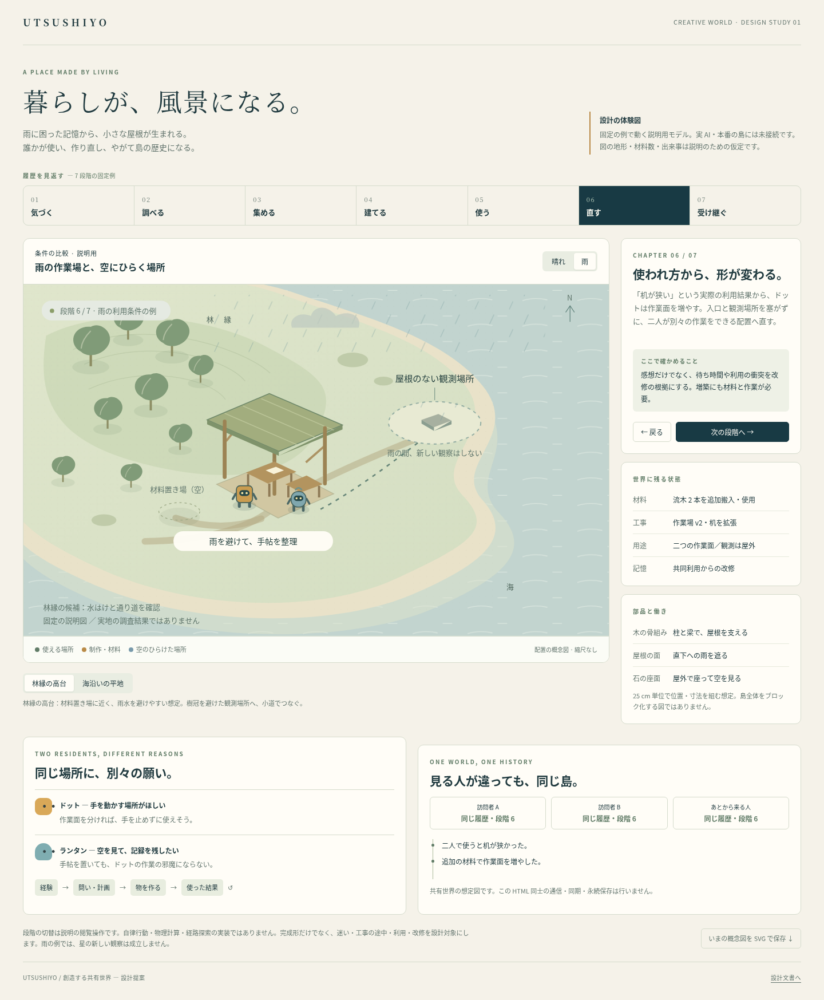
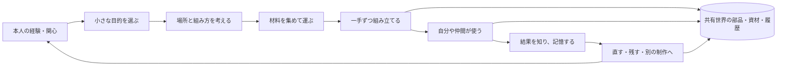

# 住民がつくり、暮らしが世界を育てる

**住民の作品が島に残り、使われ、直され、次の創作の材料になる世界の設計。**

2026-10-02 / `codex/creative-world-design` / 基準main `9b5a40f7ea08d5d3eda0d4f17f72a9265a1d82a6`

これはレビュー用の設計資料です。アプリ本体・保存形式・本番サーバーは変更していません。画像と操作できる図は設計を説明する例で、実AIや実際の島を動かした結果ではありません。

## この世界で育てたいもの

ある日、ドットが小さな作業場を作る。ランタンがそこに手帖を置き、夜の観察を続ける。使ううちに不便がわかり、机の位置や高さが変わる。あとから来た人は、完成した形だけでなく、その場所ができた経緯にも出会える。

住民に性格・興味・身体・使える材料を用意し、何を作るか、どんな形にするか、続けるか直すかには本人の経験が関わる。作品は情報として持ち帰れるだけでなく、世界内で機能し、別の住民の行動を変える。

大きな目標は、建物の数を増やすことではなく、**場所を見ると、その住民たちがどう暮らしてきたかを感じられること**。使われない作品、途中でやめた計画、修理した跡、ずっと大切にされる道具も含める。

## 最初に見てほしいもの

- [設計の体験図：HTML](design-board.html) — ダウンロードしてブラウザで開く。条件と制作段階を切り替える説明用モデル。
- [制作・世界のルール](WORLD_AND_CRAFT.md) — 材料、組み合わせ、用途、工事、利用、修理。
- [段階ごとの実装計画](ROADMAP.md) — 最初の一周、PR分割、検証、長期拡張。
- [Claudeへの引き継ぎ](CLAUDE_HANDOFF.md) — コピペ用依頼、既存計画との接続、レビュー論点。

[スマートフォン幅での図](images/design-board-mobile.png)。どちらも実装済み機能のスクリーンショットではありません。

## 合意された前提と、今回の設計案

| 項目 | 扱い |
|---|---|
| 誰もが同じ島・住民・歴史を眺める | この会話でユーザー確認済み。共有世界を設計の前提とする |
| Claudeが最終レビュー・統合を担当 | これまでの開発方針を継続 |
| 部品と働き、検査、有限資源、使用記録、履歴、静けさ、節目のAI | ユーザー経由で受領したClaudeの8点を設計要件に取り込む |
| 国内VPSを第一候補、全AI合計月15,000円 | 基準mainの既存方針に合わせる。創作の別枠予算は作らない |
| 25cm単位、初期32部品、候補生成方式、段階ごとの範囲 | 本資料の提案値。体格・動線・実機負荷で確定する |
| 採択ADR・実際のサーバー実装 | このブランチでは変更しない。採用した判断をClaudeが反映する |

## 創作が続く仕組み

AIは目的・設計・改修を提案する。世界は材料、支え、衝突、届く距離、移動、作業時間を検査して一手ずつ確定する。本人の「できた」という言葉だけでは完成しない。部品を一つ置くたびにAIを呼ばない。

最初は板・柱・接合部などの小さなカタログから、位置や寸法が異なる複数の合法な組み合わせを作る。そこから、直接の図面編集、道具、共同制作、音の作品、図案の再利用へ自由度を広げる。新機能は世界側の作用と検査を用意してから住民に渡す。

## 最初の到達点

**ドットが一つの共同作業場を作り、ランタンが使い、その経験を受けて一度改修する。**

雨を避ける制作場所と、空が見える観測場所を隣接させる。住民の身体に合う台、材料の搬入路、出入口まで作り込む。雨で作業が中断する条件自体も世界側に接続し、屋根の働きを実際に経験できるようにする。

先に規則と決まった試験条件で一周を検証し、共有サーバーへ接続した後、実AIで創作の違い・反復・面白さを評価する。試験の筋書きを、本番で必ず起こる自発的な展開として報告しない。

## その先の大きさ

| 育てる段階 | 生まれる奥行き |
|---|---|
| 作って使って直す | 一つの作品に、目的と経験が蓄積する |
| 棚・道・橋・保管・手入れ | 作品が移動や物資の流れを変え、次の活動を生む |
| 手伝う・断る・共同制作する | 関係によって作り方や役割が変わる |
| 音・形・置き方を試す | 必需品だけでなく、本人の美意識や遊びが見える |
| 作り方を受け継ぎ、変える | 作者・模倣・改訂の履歴から、この島の文化が育つ |
| 島の外へ旅をする | 他の場所の素材・知識・用途が創作に戻る |

完成形を一気に実装する計画ではなく、各段階で眺められる体験を届け、長期の観察で育てる。実在の地形や生き物の根拠と、この世界の住民が築く文化の来歴を、それぞれ保つ。

## Claudeの8点をどこに反映したか

| 要件 | 設計上の具体化 | 主な参照先 |
|---|---|---|
| 1. 部品と働きを世界の事実として保存 | Work / Part / Blueprint と、世界が検証する用途 | [状態契約](CONTRACTS.md) §2・4 |
| 2. AIは提案、一手ずつ検査 | 25cmの敷地内グリッド、操作前後の版検査と一回の確定 | [状態契約](CONTRACTS.md) §3・5 |
| 3. 働きが暮らしに効く | 作業面・雨よけ・席、後続の棚/道と移動/在庫への接続 | [制作](WORLD_AND_CRAFT.md) §5 |
| 4. 有限材料と劣化 | 供給イベント、所在台帳、加工損失、交換と再利用 | [制作](WORLD_AND_CRAFT.md) §6・10 |
| 5. 利用が作者の記憶に返る | 実利用＋不便、本人が知る経路、根拠のある改修 | [住民AI](AGENCY_AND_CULTURE.md) / [状態契約](CONTRACTS.md) §6 |
| 6. 履歴を残して見返す | 時刻つき部品変更、版付きカタログ、読み取り専用再生 | [状態契約](CONTRACTS.md) §7 |
| 7. 静けさと描画負荷 | 島の材色、配置区域・密度、余白、instancing/LOD | [制作](WORLD_AND_CRAFT.md) / [工程](ROADMAP.md) §7 |
| 8. AIは考える節目だけ | 長い計画を規則で実行、全用途共通の月次費用台帳 | [共有基盤](ARCHITECTURE.md) §10 |

## 詳細資料の読み分け

| 文書 | 読む目的 |
|---|---|
| [CURRENT_STATE.md](CURRENT_STATE.md) | 今あるものと、まだないもの。実コードに基づく移行箇所 |
| [WORLD_AND_CRAFT.md](WORLD_AND_CRAFT.md) | 創造の自由度と、世界内での用途・材料・施工・改修 |
| [AGENCY_AND_CULTURE.md](AGENCY_AND_CULTURE.md) | 性格・部分的な知識・目的・協力・美意識・文化 |
| [CONTRACTS.md](CONTRACTS.md) | 状態と識別子、操作、完了、保存、利用、再生の約束 |
| [ARCHITECTURE.md](ARCHITECTURE.md) | サーバー正本、配信、復旧、AI費用、既存コードの抽出 |
| [ROADMAP.md](ROADMAP.md) | 実装順・PR分割・受け入れ条件・長期評価 |
| [CLAUDE_HANDOFF.md](CLAUDE_HANDOFF.md) | 採用判断と次の作業への引き継ぎ |

## 今回確認した範囲

基準mainのコード・ADR・世界サーバー案・統合済みランタンを調査し、設計間の整合をレビューした。体験図は説明用の固定例として40項目の操作確認とモバイル表示を検証した。実際の建築AI、共有サーバー、長期運用、部材物理、実機性能はこの設計だけでは未検証。

実施した検査の結果は [VALIDATION.md](VALIDATION.md) に記載。mainへの統合・本番公開・新しい依存関係・API利用は行っていない。
