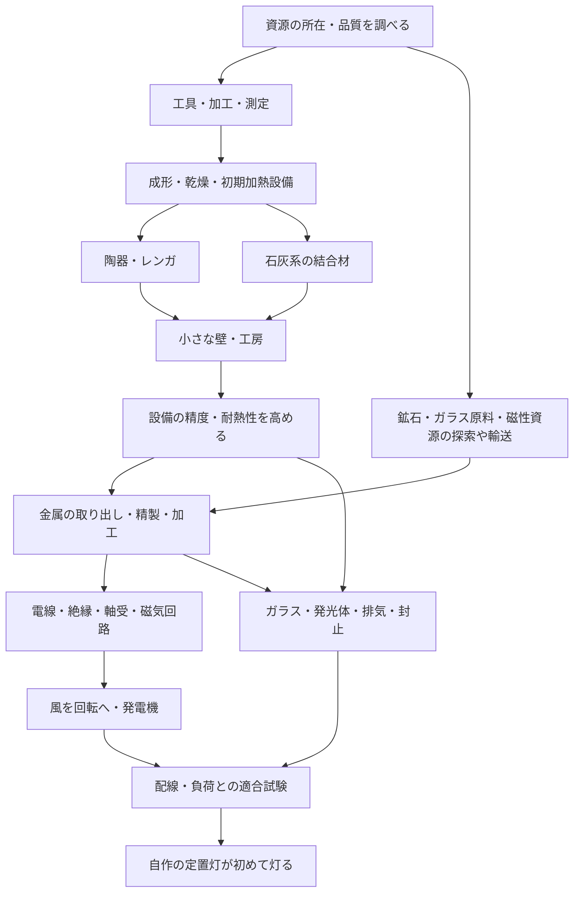

# 原料から、島の最初の明かりまで

2026-10-02追補。**ゲームモデルの設計案、未実装。** 原典の照合状況は [調査記録](SCIENCE_EVIDENCE.md)、初期工程一覧は [process-catalog.json](science/process-catalog.json)。

ユーザーの希望は、数十〜数百の科学的な加工・組み合わせを用意し、住民が原料から金属、電線、照明まで作れる長期の世界。既製の電材を回収して早く点灯する経路より、原料からの自作を優先する、と確認済み。

## 1. 目指す体験

浜で集めた材料を分け、小さな試料を作る。うまく焼けた器が次の実験を支え、試作したレンガが乾燥場や工房に積まれる。金属を扱う設備ができ、細い線を引けるようになる。風を回転へ変え、その回転から電気を得る。試作した灯りが、住民たちの作った工房を初めて照らす。

その夜、明かりから材料・道具・設備・失敗した試作へ遡れる。「誰が発電機を作ったか」に加え、器を作った住民、道具を直した住民、材料を運んだ住民の仕事も残る。途中の器やレンガの小さな壁にも用途があり、最後まで到達しない期間も暮らしを眺められる。

各工程は実装後に研究・試作できる世界の規則。設計書の順番どおりに全住民が発明する台本にはしない。美しい器を作り続ける、窯を改良する、輸送を工夫するなど、違う関心が同じ世界の発展につながる。

## 2. 「何と何を組み合わせるか」を四つに分ける

| 種類 | 例 | 世界が検査すること |
|---|---|---|
| 化学変化 | 炭酸カルシウムから酸化カルシウムと二酸化炭素 | 組成、反応条件、物質収支、熱、未反応分/副生成物 |
| 材料加工 | 粘土を成形・乾燥・焼成、金属を線へ加工 | 材料特性、形、含水、熱履歴、工具能力、品質 |
| 組立 | レンガと結合材から壁、巻線と磁気回路から発電機 | 数量、接合、支持、精度、接続、実際の働き |
| エネルギー変換 | 風→回転→電力→光と熱 | 時間ごとの供給、負荷、損失、貯蔵、装置の限界 |

測定はこれらを確かめる独立の行為。材料を消費しない測定もあり、測定器そのものや試料を毎回生成してはならない。

元素記号は物質の説明に使う。`Cu`というラベルだけでは、不純物の多い銅塊、電線に使える銅、絶縁された巻線を区別できない。木・粘土・鉱石・貝殻は混合物であり、一つの分子式へ押し込まない。組成が不明なら未測定と記録する。

周期表の任意の元素を混ぜればAIが結果を生成する方式にはしない。人が確認した有限の工程と評価器を組み合わせる。未対応の反応は「このモデルでは未対応」であり、自然界でも不可能だったと記録しない。

## 3. 貝殻、陶器、レンガの関係

一般科学上、石灰系の結合材と、粘土から作る焼成体は別の技術系統。今回、外部資料の本文照合は未完了であり、下記を実用工程の認証や現地資源の証明として使わない。

```text
石灰の系統（純物質の理想化した反応式）
CaCO3 → CaO + CO2                 熱分解、熱の供給が必要
CaO + H2O → Ca(OH)2               水和、熱が発生
Ca(OH)2 + CO2 → CaCO3 + H2O       炭酸化

粘土の系統（混合物の加工。単一の反応式ではない）
適した粘土 → 調製 → 成形 → 乾燥 → 焼成 → 冷却 → 品質確認
                                              ├ 器
                                              └ レンガ

検査したレンガ + 適合する結合材 + 支持/施工/養生 → 壁
壁 + 基礎/屋根/出入口/荷重条件の検査 → 利用可能な小屋
```

貝殻を焼くだけで陶器になるわけではない。石灰は結合材や塗り材の候補になり、焼成レンガと組み合わせられる。気硬性石灰を、水中ですぐ固まる万能な現代セメントとして扱わない。粘土製品も、焼いたら一律に防水・耐火・構造材になるわけではなく、用途ごとの試験を要する。

割れた陶器は、登録した用途の陶片や充填材等へ再利用できる。水をかけるだけで元の可塑性のある粘土へ戻すことはできない。石灰の反応が循環しても、熱を無料で循環させる装置にはならない。

## 4. 初点灯までの依存関係



これは研究と実装の依存図で、歴史を一列に再演する必須順序ではない。レンガの家の完成を、物理的な理由なくすべての発電の前提にしない。必要なのは利用できる設備・作業条件・材料であり、それを満たす別構成も許す。

### 原料から電線へ

鉱石を見つけること、金属を取り出せること、使える純度にすること、線に加工できること、絶縁して巻けることを分ける。鉱石の種類・不純物で工程が変わる。砂を選別しただけで銅線や永久磁石ができる経路は置かない。

線引きには加工可能な材料状態、工具、寸法と断線の評価が必要。導体だけ揃っても、接点・絶縁・巻線・軸受・磁気回路がなければ発電設備は完成しない。初期磁化・残留磁気・外部励磁のどれに頼る方式かを設計ごとに明示する。励磁用の電気を同じ未起動発電機から得る循環依存を隠さない。

### 原料から灯りへ

長期候補の一つは炭素を使う白熱灯。成立には、形状を制御した発光体、保持構造、透明な外殻、必要な内部環境、気密、導入線、電源との適合が必要。炭と砂を合わせるだけで電球にはしない。

ガラスの組成と品質、金属との熱膨張差、排気装置の精度と漏れ、発光体の寿命は、それぞれ調査・試作・校正の対象。真空ポンプも弁・シール・加工精度・駆動を要する。これらを確認できるまでは、この経路は長期研究候補であり、実行可能と表示しない。

LED、太陽電池、現代の高性能蓄電池は初期の簡単な合成結果にしない。原料からの製造を追加するなら、半導体や電池材料の工程を別途検証する。

### 発電と点灯

島で風を受けられても、常に同じ電力は得られない。水車は落差と流量を確認できる地域でのみ候補にする。手回しを測定用に使う場合も、住民が行った機械仕事と身体側の消費の対応を定義してから実行する。

最初の点灯は「発電している間に灯る」小さな回路でよい。昼に得た電気で夜通し灯すには、蓄電または別の蓄エネルギー技術が要る。蓄電量を記録しないまま、昼の発電フラグで夜の光を出さない。風の弱い夜に灯りが揺らぎ、使う場所を選ぶことも次の研究理由になる。

## 5. 世界と住民は別のことを知っている

世界側は版付きの工程・適用範囲・評価器を持つ。住民は、説明として知っていること、島の材料で試したこと、再現できたことを分ける。

`問い → 仮説 → 比較条件 → 実際の試作 → 観察 → 再試験 → 条件付きの作り方`

LLMが現代科学を知っている以上、完全な無知から人類史を独力で再発見したとは主張しない。知識を提案へ使っても、世界側で未成立の設備や未実行の結果を飛ばすことはできない。新しい発明の面白さは、限られた材料・設備・経験の中で、どの道を試し、どう改良するかに置く。

実験には試料ID、比較する条件、予測、実行結果を持たせる。器の吸水、レンガの割れ、線の抵抗、灯りの継続など、実装した評価器で確かめる。一度の成功で万能レシピを永久解禁せず、別ロットや条件変更に対して再現できた範囲を残す。

測定器がなければ世界内部の正確な値をAIへ渡さない。見た色、持てる時点、漏れの痕跡など、実装した知覚と、その測定限界を使う。計器を作れたことで、以前は推測だったことが測れるようになる。

失敗試料も在庫と記録に残る。実験採用前に、試料・燃料・通常の歩留まり/試料損失を有限の研究配分へ予約する。その範囲内で狙った性質を得られなかった結果は、失敗した通常試作として記録する。試作のたびに事故の7日枠を使う設計にはしない。

予定範囲外の追加損失や周辺設備への被害はIncidentへ束ね、[逆境の上限](ADVERSITY_AND_RECOVERY.md) を適用する。結果を見てから研究配分を増やして被害を付け替えない。生活・回復用の保護資源は研究へ回さず、通常の研究消費も新規制作や暮らしを圧迫していないか評価する。

## 6. 工程の共通モデル

実行用の `ProcessDefinition` は次を満たして初めて有効になる。今回のJSONは、その手前の工程候補と依存関係の一覧であり、数量付きの実行レシピではない。

| 項目 | 実行時に必要な意味 |
|---|---|
| 定義と出典 | ID・版・対象現象・照合済みの根拠・簡略化・適用範囲 |
| 入力 | 実在ロット、量と単位、組成/品質、含水等の状態。設備と工具は消耗材と分ける |
| 条件 | 実在設備の能力、到達できる熱履歴、時間、雰囲気、精度等。未校正の条件では実行不可 |
| 出力 | 生成物、未反応分、再利用材、副生成物、気体/排水等。失敗時も行先を残す |
| エネルギー | 熱・機械仕事・電気の供給元、消費・損失・蓄積。反応熱もモデルの対象範囲内で計上 |
| 検査 | 何を測定したら、どの用途へ使えるか。単なる工程完了と合格を分ける |
| 永続化 | 対象版、入力予約、進捗、材料/エネルギーの確定量、再開条件、イベント |

### 物質収支

乾燥で水が出る、石灰の焼成でCO2が出る、水和で水を取り込む、炭酸化で大気のCO2を取り込むことを明示する。固体製品の重量だけを比べて消失/複製を判定しない。

純物質の反応式では元素ごとの収支を検査する。混合物は既知組成の範囲と未測定分を持ち、精度以上の保存判定をしない。大気や排出の境界流も出所・量・時刻を記録する。開放系の大気を材料アイテムとして無限生成することと、必要な流入をモデル化することを分ける。

### 熱と電気

温度と熱量を分ける。同じ温度でも量や材質で加熱に必要なエネルギーが異なる。単に熱量の合計を満たせば、低温設備で高温工程が成立するとはしない。設備の到達可能条件と工程中の履歴を評価する。

電力はW、電力量はWhまたはJ。単位換算 `1 Wh = 3600 J` を明示し、供給量は実行した時間区間で積分する。発電・変換・蓄電・配電・負荷の各損失を重複なく計上する。温度・電力を在庫アイテムへ変換しない。

ループを組んでも、記録した外部入力以上のエネルギーを取り出せないことを検査する。蓄電の充電/放電は状態と容量・効率・出力限界に従う。電力量が残っていても、電圧・電流・接続・装置の定格が適合しなければ灯らない。値は機器モデルの検証後に決める。

### 加工中の停止

`ProcessRun` は入力を予約し、作業/熱処理を経て、生成物と副産物を一度だけ確定する。制御した冷却も工程の一部。サーバー停止中の未知の温度・燃焼を後から創作しない。運用停止では整合したチェックポイントから再開する方針を明示し、世界内の停電や燃料切れによる中断と区別する。

設備を利用できる能力は、そのWorkが現存し、検査に合格し、他者が占有していないときだけ使える。過去に窯を一度作った、という永久の解禁フラグにしない。

## 7. 科学と現地の資源をつなぐ

嘉弥真島の粘土、鉱石、耐熱材料、ガラス原料、磁性資源、淡水、持続的な燃料供給は、今回確認できていない。現実の地名がある世界で、必要だからすべて採れることにはしない。

所在と利用条件を確認できない材料は未確定のまま置く。将来、別地域から原料を持ち込むなら、地質の根拠、採取可能範囲、採取量、輸送の能力・時間・履歴を用意する。ユーザーの「島の外まで広がる世界」と科学の依存関係をここで接続する。

生きたサンゴや住処として使われる貝殻、地形、植生を、無制限の原料扱いにしない。採取可能な資源ノード・再生速度・保全する範囲を別に持つ。景観を一律に工業化する必要はなく、小さな工房と、元からある木や石の作品が併存できる。

初期の炉や窯を作るのに、その窯でしか作れないレンガを必須にしない。初期工具・火・容器・耐熱構造・原料のそれぞれについて、最初の一歩が成立する構法を資料で確認する。依存が循環する箇所を、無料の初期設備で黙って埋めない。

## 8. 既存ロボットと「最初」の定義

基準コードの住民には既に内蔵灯・電池相当の状態がある。現行の正規化されたbattery値には容量Whの定義がない。これを任意のWhへ換算して工房に供給したり、住民を分解して高度部品を得たりしない。

既存装備は `legacy / sealed_bootstrap` として維持する。身体能力は使えても、加工設備や外部電源への無制限の供給源ではない。接続を追加するなら別途容量と仕事量の契約・移行が必要。

本作の到達点は **「出所を追える原料から住民が製作した発電設備・配線・照明で、島の定置灯が初めて点灯した」** こと。住民の目や既存の灯りが光っていた事実を消さない。工具や知識などの出発条件も記録し、何もないところからすべてを独力で発明したと偽らない。

開発用に既製の発電機や灯りを使う試験世界を用意してもよい。その点灯は配線・収支を検査する対照試験であり、本世界の原料自作による達成には数えない。

## 9. 小さく導入し、長く育てる

S0〜S7は科学側の開発区分で、世界全体のG0〜G6とは別。住民が順番どおり進むレベル制ではない。

| 区分 | 届ける体験 | 導入条件 |
|---|---|---|
| S0 資源と測定 | 試料を集め、違いを観察する | G2の台帳/共有、G3の経験、現地資源と出発工具の確認 |
| S1 材料加工 | 乾燥・繊維・木工・粘土の成形 | 工程の時間/入力/出力/中断が一貫 |
| S2 熱と結合材 | 焼物・レンガ・窯、石灰の別系統 | 熱履歴、燃料、品質、反応と原典照合 |
| S3 建物と機械 | 壁・工房、軸・軸受、風を受ける機構 | G4の施工、支持/養生、寸法/摩擦/仕事量 |
| S4 鉱物と金属 | 鉱石から加工可能な金属、ガラス原料の評価 | 原料の調達、精製、耐火、工具精度 |
| S5 導体・磁性・ガラス | 電線と絶縁、磁性材、ガラス素材 | 材質・加工条件、磁化の出発点、熱の校正 |
| S6 発電と灯りの部品 | 発電機、ガラス外殻、排気機器、発光体、風駆動 | 未成立の高度依存、仕事/電気、測定の成立 |
| S7 照明と初点灯 | 灯体の組立・排気・封止、一灯が灯り維持を考える | 原料の来歴、実供給と負荷、寿命/修理、夜への影響 |

島外資源を要する部分はG6の地域/輸送と合流する。科学のためにG1の共同作業場の完成を待たせない。S2で最初の器を届けた後も、残る高度工程を長期開発できる。

最初の実装単位は「少量の確認済み粘土から二つの試験片を作り、乾燥/焼成条件と吸水や割れの差を記録する」。現地粘土が未確認なら明示した試験世界のみで行い、共有の島へは輸入等の出所を決めてから接続する。最初から全カタログを稼働させない。

## 10. 数百へ拡張しても守る条件

工程は意味のある変化・設備能力・測定単位で増やす。色違いの器100個を科学工程100件とは数えない。初期JSONは82工程（本世界の候補76、開発の対照試験6）、材料94種、能力120件、到達点8件。ID・依存・概念・確認待ちをレビューするための候補集であり、全件が実行前の概念案。

追加時には、出典と適用範囲、入力と副産物、熱/機械/電気、設備、観測方法、失敗時の現物、初期資源からの到達性を揃える。カタログの追加だけで本番実行を有効にせず、照合・校正・実装・試験の門を通す。

静的検査はID参照、工程の分類、記載された反応式の元素収支、依存関係の欠落を検出できる。化学式が合うことは、反応がその条件で進むことの証明ではない。依存グラフの到達は、十分な原料・時間・熱・性能があることの証明でもない。

実行機能では、材料/元素とエネルギーの収支、二重消費、中断/再起動、使えない設備、条件外の反応、測定器の限界、視聴者数との独立、初点灯の出所を試験する。現在これらは未実装。

夜の完成演出は、世界が点灯を確定した事実から描画する。カメラや字幕が先に成功を決めない。島全体を明るくせず、最初は作業面の小さな光と、そのそばへ来る住民を見られるようにする。
