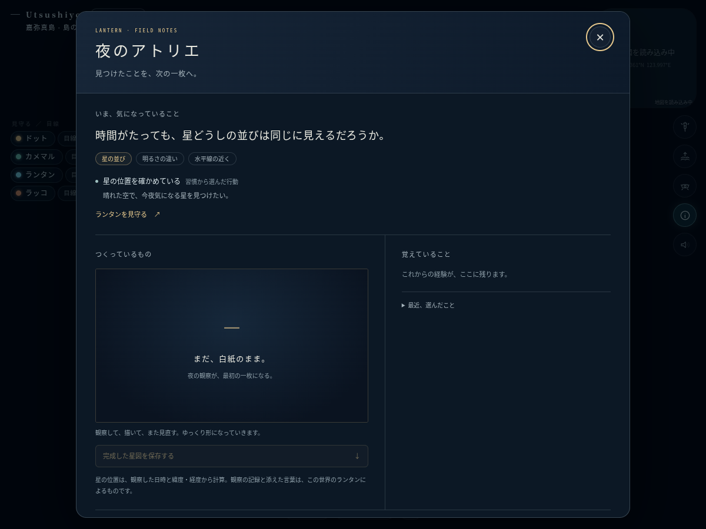
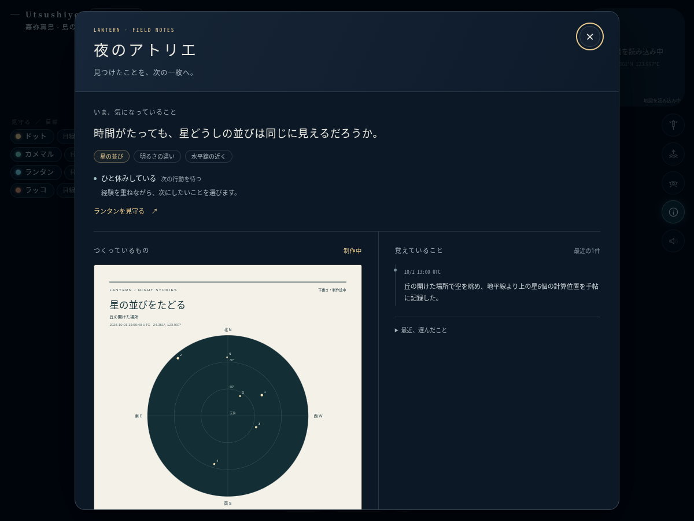
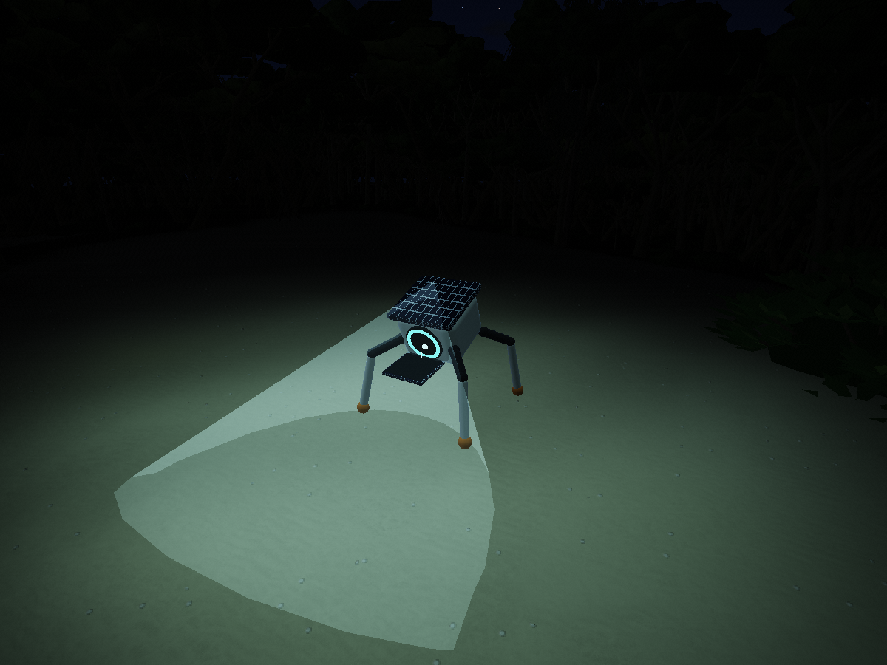
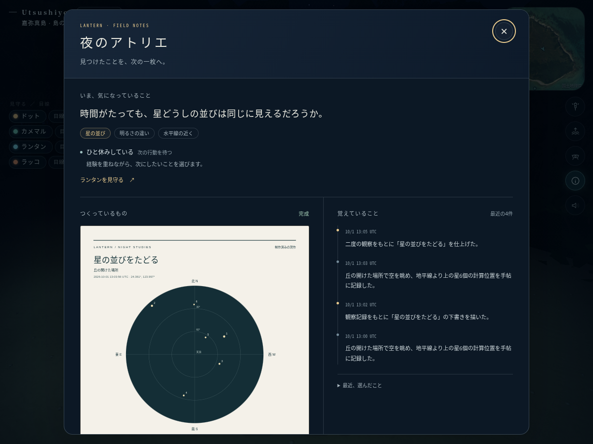

# ランタンの夜のアトリエ

星が好きなランタンが、空を観察し、問いを持ち、下書きを描き、もう一度確かめて一枚を仕上げる試作です。途中の作品と経験は保存され、次の行動に使われます。完成した星図はSVGとして持ち帰れます。

- ブランチ: `codex/lantern-autonomous-study`
- 実装コミット: `c6827eb12446384bed2fd967da6e9b419b0d2f02`
- 基準main: `fd492b4c94db51f390877a4d76a7891c58a3c250`
- [Claudeへの引き継ぎ・コピペ用依頼](CLAUDE_HANDOFF.md)
- [判断・記憶・作品の設計と限界](DESIGN.md)
- mainへの統合・本番サイトへの反映は行っていません。

## 実際の島での記録

以下はアプリの移動・作業を実行して撮った記録です。日時を2026-10-01の夜に設定した検証環境で、生態・住民の更新を進めています。天候は試験用の晴天条件、行動選択はルールです。実APIが生み出した行動や、現地での観測とは区別してください。

| 場面 | 画像 |
|---|---|
| 最初は白紙 |  |
| 観察から生まれた問いと下書き |  |
| 島で実際に描いているところ |  |
| 二度確かめて仕上げた作品 |  |

[制作中の約6秒動画](images/lantern-drawing.mp4) / [完成した星図のSVG](images/lantern-completed-study.svg) / [星図の画像](images/lantern-completed-study.png) / [スマートフォン幅](images/atelier-mobile.png)

## できるようになったこと

- **行動の選択**：観察、描画、探索、休息、近くの仲間への作品の共有。睡眠や運搬中の用事、共同作業は引き続き優先します。
- **関心と問い**：星の並び・明るさ・水平線付近への関心を持ち、完了した経験によって少し変化します。途中の作品の問いを次回も引き継ぎます。
- **結果に基づく記憶**：その場所に到着し、作業時間を終えた結果だけを記録。移動失敗や中断は成功扱いにしません。
- **作品**：二度の観察と二度の描画で完成。星の位置は既存カタログと日時・緯度経度から計算し、AIの文章から座標を作りません。
- **任意のAI判断**：有効にすると、本人の記憶・関心・作品・現在の条件を渡し、実行可能な候補から次の行動を提案してもらいます。説明・問い・作品に添える言葉も生成できます。

## 試す方法

このブランチを起動し、URLに `?lantern-study#kayama` を付けて嘉弥真島を開きます。既存の画質などのクエリと併用する場合は `&lantern-study` を追加します。

「島の住人」のランタンにある「星の手帖と、いま気になること」からアトリエを開きます。「ランタンを見守る」で島の中の姿を追えます。開発用 `?debug&lantern-study#kayama` では `seaglass.openStudy()` でも開けます。

住民は現実の日本時刻で暮らします。昼間は眠ることがあり、空の表示を夜へ早回ししても、住民の記憶や時刻は変わりません。夜でも雲や電池、他の用事によって制作を待ちます。検証用の時刻制御は撮影スクリプト側で行っており、通常のUIに早回しボタンは追加していません。

AIは初期状態でオフです。利用する場合は既存の「AIで言葉を書く」に本人のAnthropic APIキーを設定し、アトリエの「ランタンの行動の選び方」で有効にします。API利用料が発生します。単一タブの試作上限は、判断が最短5分間隔、既存の会話と合わせて1日120回です。費用をサーバーで強制制限する仕組みではありません。

住民の状態と記憶は別キーに保存します。初回だけ既存の島を読み取りで引き継ぎ、それ以後は独立した試作の暮らしになります。画質などの設定、APIキー・使用回数、観賞ログは既存と共通です。

## 今回の範囲

自発性を育てるための、小さな行動・記憶・制作の循環です。APIなしの行動はルールで選び、台詞や作品の変化をモデルが生成したようには表示しません。現在は星の研究という範囲と5種類の行動を用意しています。自由な道具の発明やコードの自己改変、モデル本体の再学習、自我・意識の成立を実装/確認したものではありません。

保持するのは作品6件、観察24件、記憶48件、判断32件まで。古い作品が永久に蓄積される仕組みではありません。完成SVGは保存できます。長期の作品庫、他の住民の独自の制作、新しい研究テーマ、サーバーでの継続した暮らしは次の候補です。

恒星は既存の約5000星のカタログから20星を選び、地平線上の計算位置を記録します。歳差・固有運動・地形による遮蔽・個々の雲・月明かりによる視認性は未再現です。星図は最後の有効な観察時刻の空を描き、複数時刻の星を一つの空に混ぜません。文章は創作、雲量の入力元は実天気または演出用の設定と明記します。

## 検証

型検査・本番ビルド、判断と保存、API通信の模擬検証、星座標/SVG、住民タスクの実行、既存ランタンの歩行、宮古島の生態シミュレーションを実行し、通過しました。結果は [validation](validation) に保存しています。

判断の検証では20夜・200回の行動完了を進め、30作品が完成し、保存件数が上限内に収まることを確認しました。これは規則と状態遷移の検証であり、LLMの長期的な創造性の評価ではありません。API通信は264回の模擬リクエストで、形式不正・中断・8秒のタイムアウト・回数制限・保存障害を確認しています。実API通信は行っていません。

実島では2回の観察と2回の描画による完成、次の場所まで約16.1mの移動と探索完了、再読み込み後の作品保持と途中行動の中断、通常の住民保存が変わらないこと、390px幅の表示を確認しました。JavaScript例外・アプリのローカル素材読込失敗・WebGLエラーはいずれも0です。

実島の描画はクラウドChromium / SwiftShaderです。動画は固定ステップで描画した約6秒の記録で、FPS測定ではありません。実GPUでの速度やWindows/ANGLE互換性は未測定です。描画モデルには制作中だけ見えるスレート等7メッシュ・190三角形を追加しています。クラウドの通信制限で既存の外部フォント・天気APIを取得できなかったため、代替フォントと試験用の天候で撮影しています。実天気取得の成功は今回の検証対象に含みません。

撮影・時計・保存・UI操作の詳細は [capture.cjs](capture.cjs) と [ブラウザ検証記録](images/browser-report.json) を参照してください。

## 取り込み時のレビューと変更（main統合時）

最新main（跳躍カメラ・ウミガメ・フレーム保護を含む）へ統合し、型検査・ビルド・ランタン系5本の検査を再実行しました。統合時に次を変えています。

- **観察の間隔**：同じ作品の2回目の観察は、前回から45分以上あとにします。以前は約2.6分差の2回で完成しており、「時間がたっても並びは同じか」をほぼ同じ空どうしで比べていました。
- **星図**：最初の観察の位置を淡い輪、最新の位置を点で描き、同じ星どうしを点線で結びます。2つの時刻はそれぞれ明記し、1つの空として混ぜていません。
- **待つあいだ**：研究ですることがない時間は、ランタンのいつもの暮らし（石積みなど）に戻ります。以前は探索と休息を1分半おきに繰り返していました。
- **API**：会話の応答待ちは20秒に戻し、行動判断だけ8秒にしました。行動判断は1日120回のうち最大80回までとし、残り40回は会話用に残します。
