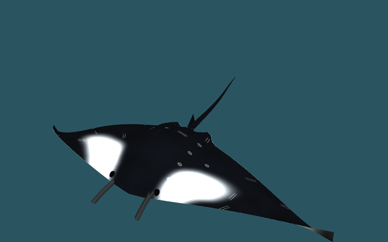
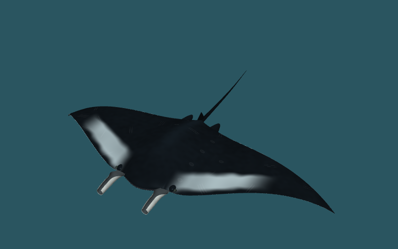
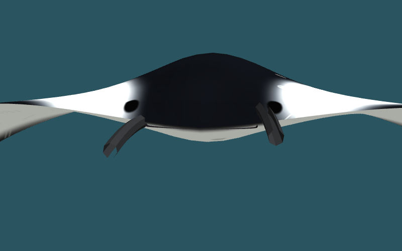
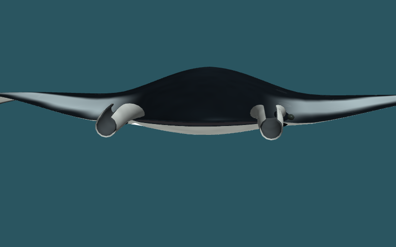
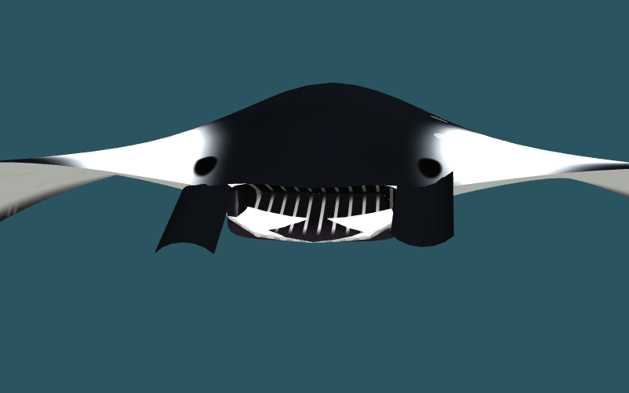
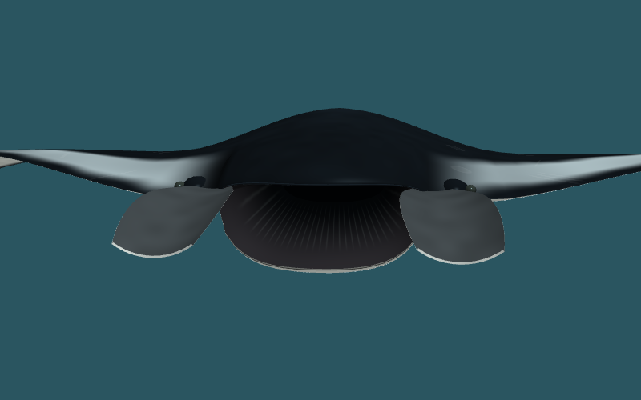
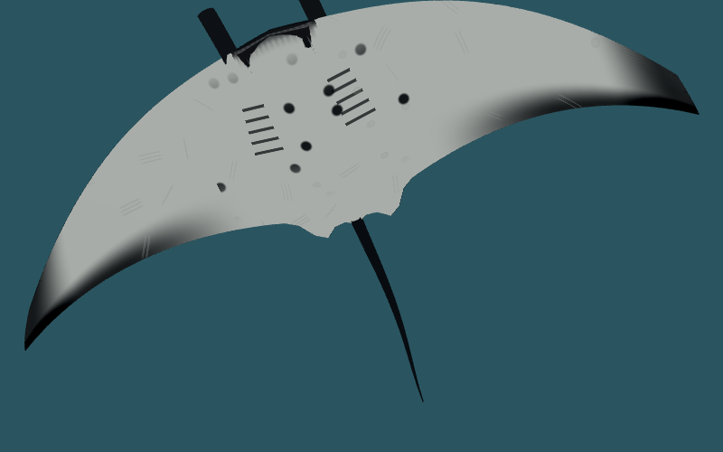
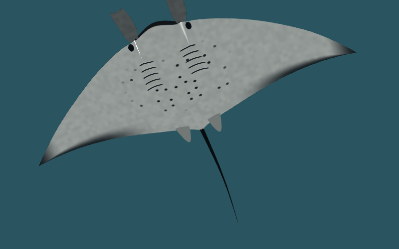

# マンタのリモデリング案

Claudeによる確認・選択・統合のための試作です。正式仕様ではありません。

- ブランチ: [`codex/manta-remodel-prototype`](https://github.com/ynatsume-source/3dproject/tree/codex/manta-remodel-prototype)
- 制作の基準: main `4219cb0fdd5a7450d8d6e821ab1db4f49aca27ba`
- 引き継ぎ: [CLAUDE_HANDOFF.md](CLAUDE_HANDOFF.md)

## 目指したこと

皮膚から唇・口腔が続く立体としてマンタを描きます。巡航時には頭鰭を巻き、採餌時には広げて口を開く。翼は付け根から先端へ遅れてしなり、跳躍では水中の力強い羽ばたきから空中の姿勢、着水後の泳ぎへつながります。

提供された写真は形・部位・動作の参考として観察しました。写真の再配布やテクスチャ転用はしていません。特定の写真・個体を正確に復元したモデルではありません。

## 画像で比較

実アプリのモデルを既存の `seaglass.studio` で描画した画像です。生成イメージや写真ではありません。同じ照明・視線・uniform指定ですが、境界箱が変わるため画面内の大きさは厳密なピクセル比較にはなりません。

| 場面 | 変更前 | 変更後 |
|---|---|---|
| 全体 |  |  |
| 巡航時の口・頭鰭 |  |  |
| 採餌時の口・頭鰭 |  |  |
| 腹面 |  |  |

背面・側面も [images](images) にあります。条件・描画エラー記録は `before.json` / `after.json`、再撮影は [capture.cjs](capture.cjs)。変更前は基準版のdev、変更後はこのブランチのproduction buildを用います。

## 造形と動作

| 場面・部位 | 今回の変更 |
|---|---|
| 胴体・翼 | 厚い中央部、薄い翼縁、先端へ遅れて届く屈曲。変形に照明の法線も追従 |
| 口・頭鰭 | 皮膚・唇・口腔が同じ境界で動く。頭鰭の巻き込み/展開と開口を独立制御 |
| 眼・腹面 | 側面の小さな眼、5対の鰓の模様、個体ごとに変わる腹面斑点 |
| 遊泳・行動切替 | 位相を積算して翼の跳びを防止。昼夜の場所・深度・姿勢を補間し、追跡位置を実際の体の位置と一致 |
| 採餌の宙返り | 十分な水深がある場所で潜ってから回転し、浅場へ復帰。浅い場所では円を描く採餌を続ける |
| 跳躍 | 助走・離水姿勢・空中の翼保持・着水・再遊泳を連続化。空中は推進の羽ばたきを止める |
| しぶき・回転 | 翼付近から水滴。60Hz時の離水しぶき欠落と、着水後の不要な360度巻き戻しを修正 |
| 呼び出し元 | 通常個体・群泳・跳躍・図鑑で共通モデル。既存海域データからreef/oceanicの模様を選ぶ |

昼夜の採餌切替、跳躍の抽選頻度、暗夜での抑制は既存アプリの習慣・演出を引き継いでいます。マンタ一般の生態をこれだけで表すものではありません。

## 互換性と負荷

新モデルは `src/ocean/manta.ts` に分離し、従来どおり `src/ocean/models.ts` から `MANTA_GEO` / `mantaMaterial` を公開。1個体は1メッシュ・1マテリアル、前方向 `+z`、翼幅 `2 × mesh.scale.x`。依存関係・保存形式・住民の記憶を変更しません。

| uniform | 契約 |
|---|---|
| `uPhase`, `uBeat`, `uAmp`, `uSeed` | 既存の位相・速度・振幅・模様。`uBeat=0` で外部積算可能 |
| `uFeed` | 0–1。頭鰭の巻き込み→展開。従来の口制御もfallbackとして維持 |
| `uMouth` | 新規0–1の独立した開口。初期値 `-1` では `uFeed` に追従 |
| `uBank`, `uAir` | 新規。翼の左右差と空中姿勢への移行。初期値0 |
| `uOceanic` | `mantaMaterial(true)` の模様変種。引数省略可能 |

旧2,548頂点 / 4,657三角形から、新6,662頂点 / 11,686三角形へ増加。新ジオメトリのattributeとindexは合計416,540 bytes。共有バッファですが、翼の変形・法線計算は増えており実機の速度評価は別途必要です。

## 検証の再現

```sh
npm ci
npm run typecheck
npm run build
npx tsx --import ./scripts/node-assets.mjs scripts/manta-check.ts
npm run sim -- miyako
npm run preview -- --host 127.0.0.1 --port 4178
```

`manta-check.ts --baseline /path/to/base-checkout` では同じ依存関係を導入した基準版との非マンタ部分・クジラ軌跡の比較も行えます。描画の再撮影には別途PlaywrightとChromiumが必要です（アプリの依存関係には追加していません）。

```sh
CHROMIUM_PATH=/usr/bin/chromium node docs/proposals/manta-remodel/capture.cjs http://127.0.0.1:4178 after
```

確認した結果:

- 型検査・production build・宮古の昼/夕/夜/朝シミュレーション成功。[シミュレーション出力](simulation.txt)
- [39ケースの検証結果](validation.json): 3海域の通常行動、口/頭鰭/位相、昼夜切替、採餌準備→潜降→7秒回転→復帰、浅底での抑制、群泳、跳躍の正逆回転、暗夜での自然発生抑制、画面内で消えない処理など。
- 採餌の回転は最大サイズのreef/oceanicを30/120Hzで検査し、モデルの保守的な境界形状と静水面との余裕は2.53m以上。抽選の乱数を制御して開始条件を通しており、回転状態を直接強制した検査ではありません。波面の保証ではありません。
- 非マンタモデルとカメの更新処理は基準版と同一。クジラは同じ乱数で3,000ステップの軌跡が完全一致。
- 簡単な直線の礁境界で移動候補の棄却・反転を確認。実際の全海域での経路探索を保証する検査ではありません。

検証環境はNode 22.23.3、Linux Chromium / ANGLE Vulkan SwiftShader。天気・外部フォントの通信失敗は画像のJSONに別記録しています。アプリの既存fallbackと撮影時の明示した天気設定を使用しました。

## 適用前に見る点

- 鰓は模様と陰影で、実際の開口ではありません。口腔内部も観賞用の簡略表現です。模様は厳密な種・個体識別資料ではありません。
- 翼は手続き的変形、跳躍は既存の運動式に沿った演出。生体計測や流体力学から同定したシミュレーションではありません。
- 地形回避は周辺点の確認で、連続した障害物回避経路の完全保証ではありません。波面と全身形状の衝突計算も行いません。
- Linux Chromium + SwiftShaderの描画確認と、Windows ANGLE / Direct3D11・スマートフォンでの確認は別です。後者は未実施です。
- mainへの統合・公開はClaudeの最終確認後に行ってください。このブランチは本番へ適用していません。
