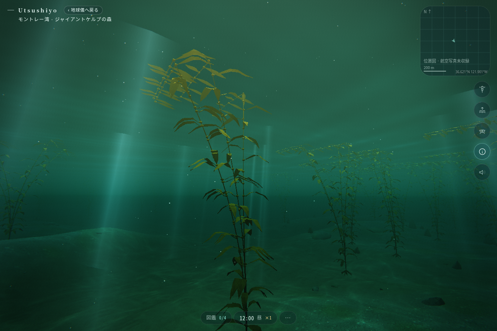
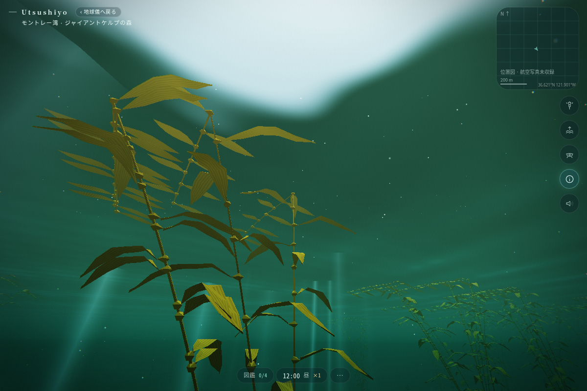
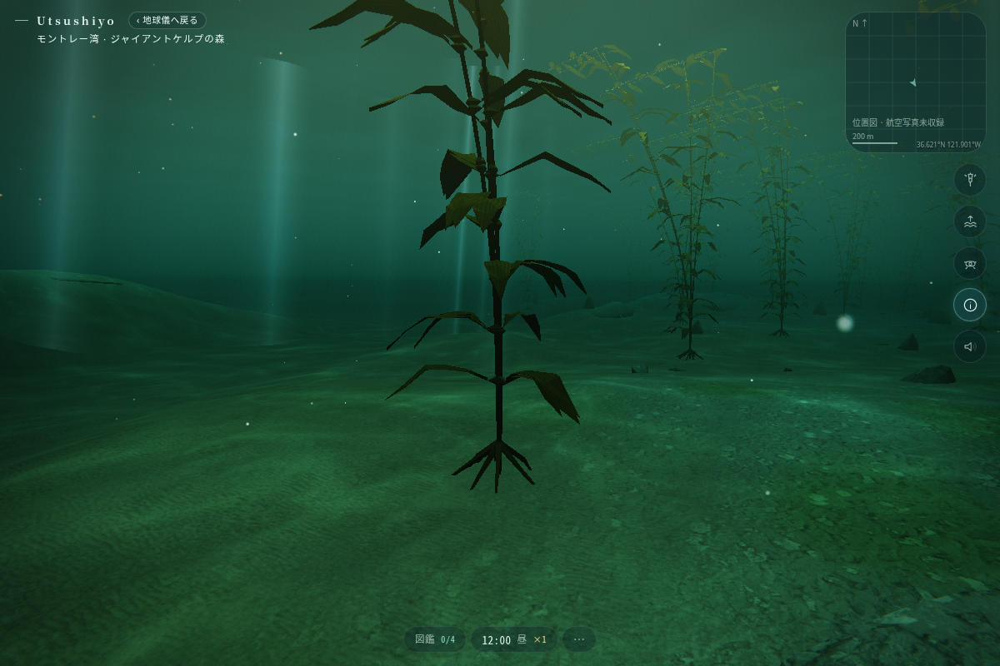

# モントレー湾 — ジャイアントケルプの森

Claude が確認・調整・採用するための、動く新海域の試作です。設計資料だけのブランチではありません。

- ブランチ: `codex/monterey-kelp-prototype`
- 開始点: main の `7124cc649a881a805499eb6effa37caa49a92e3d`
- 海域 ID: `monterey`。地球儀・海域一覧から選べます。
- 新しい依存パッケージ、保存形式、LLM 呼び出しはありません。
- 別件の沈没船改善: `codex/carnatic-wreck-detail`。相互依存しません。
- [Claude 向け引き継ぎ](CLAUDE_HANDOFF.md)

## この海を選んだ理由

既存の沖縄・GBR・モルディブ・紅海はサンゴ礁、カルナティックは沈船、ガラパゴスは火山性岩礁、太平洋は外洋。それに対して、冷たい海に生える大型褐藻が「海底・中層・水面」をつなぐ景観を追加しました。

遠くの青を眺める海に対して、ここでは緑がかった水の中で、長い茎の向こうに別の茎が揺れ、上を見ると琥珀色の葉の層が空を細かく区切ります。地形には砂の通路を残し、密な森と開けた場所を行き来できます。

| 葉・気胞と水面側 | 岩に付着する部分 |
|---|---|
|  |  |

画像は production build を Chromium 151 / SwiftShader で動かしたスクリーンショット。1200 × 800、low tier、2026-06-20 20:00 UTC。生成イメージや現地写真ではありません。

## 作ったもの

- モントレー湾の地域を示す座標、冷たい水の色、岩礁と砂地の手続き地形、巡航路。
- 岩に絡む付着器、1 株から伸びる 4 本の茎、葉の付け根の気胞、細長い葉、横へ流れる水面近くの葉。
- 根元を固定し、上ほど大きく動く揺れ。葉先には小さな動きを重ねる。鑑賞用 `U.uTime` のみを使う GPU 処理。
- 熱帯サンゴの生成をゼロにし、青いヒトデ・チンアナゴ・クマノミなどを置かない構成。
- 中層のケルプ・ロックフィッシュとブルー・ロックフィッシュ、泳ぎ回るセニョリータ、海底寄りのブラックパーチの 4 種。
- 「ケルプの森」「水面の葉の層」「森の間の砂地」の行き先と、ケルプの図鑑解説。
- 航空写真の未収録海域では、方位・縮尺・座標を示す位置図。前の海域の画像を表示し続けない。

## ノンフィクションと景観上の推定

地域と生物の選定は実在の環境を基礎にしていますが、海底形状・株の位置・密度は手続き生成です。現地測量や現在のケルプ分布ではありません。座標はこの地域を示す代表点で、特定の観測区画の再現を主張しません。

気胞で浮く褐藻、岩へ付着する構造、温帯性の魚という関係を優先しました。実物の葉数・太さ・流体挙動、種ごとの体形・模様は簡略化しています。

確認候補:

- [Monterey Bay Aquarium: Giant kelp](https://www.montereybayaquarium.org/animals/animals-a-to-z/giant-kelp)
- [NOAA Monterey Bay National Marine Sanctuary: Kelp forests](https://montereybay.noaa.gov/sitechar/kelp.html)

これらの外部ページは、今回のクラウドではネットワーク制限で取得できませんでした。新たに閲覧・照合済みの出典ではありません。公開前に、魚の同定・説明・生息環境、景観の密度・色を資料で確認してください。

## 確認と負荷

- Node 22.23.3: `npm run typecheck`、`npm run build` 成功。
- `npx tsx --import ./scripts/node-assets.mjs scripts/kelp-check.ts` 成功。全属性の有限値、index、bounds、配置再現性、行き先、熱帯サンゴが生成されないことを確認。
- ケルプ 211 株 / 764576 頂点 / 38 バッチ。初期の密度・形状案から頂点数を約 39% 減らした。1 葉ごとの Mesh は作らず、40 m 区画でまとめ、揺れ幅を含む bounds で画面外を省く。
- `npm run sim -- monterey`: 昼・夕・夜・朝を実行。4 種の行動が進み、完走。
- production preview の 3 視点で、JS / shader エラー、WebGL context loss、`gl.getError()` エラーなし。
- 既存の Vite の `__dirname` 将来互換警告は残っています。

ブラウザの海域往復・夜間確認の結果は [引き継ぎ](CLAUDE_HANDOFF.md) に記載しています。

## 最終実装へ向けた限界

- モデルは手続き形状の初版。特に付着器・気胞の近景は低ポリゴンです。魚は既存モデルの再利用で、ロックフィッシュの背びれやセニョリータの尾の斑紋は種専用に作り込んでいません。
- 魚は既存の生態系で行動します。ケルプに隠れる専用行動・セニョリータの砂潜り・ケルプへの接触判定は未実装です。植物の茎でドローンを止めません。
- 葉の逆光表現はありますが、ケルプによる実際の投影影・光線遮蔽は未実装。水面側の高さも潮汐と完全には連動しません。
- 株数や茎の本数は全画質で共通。区画の culling のみで、距離に応じた専用 LOD は未実装。通常 GPU の FPS や低メモリ端末での負荷は未検証です。
- 岸の地形・現地航空写真・ラッコやアザラシはまだ加えていません。既存の住民ラッコを野生動物として流用していません。
- 時刻は既存 `Sea.tz` の固定 UTC−8。夏時間の時計表示は未対応。太陽計算は UTC と緯度経度を使用します。水温・潮汐も既存の簡易モデルで、現地観測値ではありません。
- Windows ANGLE / D3D11、iOS Safari、長時間滞在、端末をまたぐ保存については未検証です。保存キー・住民状態の形式は変えていません。
