# ポイントロボス — 海藻の層と生き物の暮らし

周遊中の岩場にケルプのまとまりを増やし、足元の海藻、葉や岩の小動物、魚の昼夜の暮らしを加えた試作です。野生のゼニガタアザラシが、ときどき森の縁を泳いで通りかかります。

- ブランチ: `codex/point-lobos-living-forest`
- 基準: `b001aeb9d81f887ebcab3c2d01823629de04fcf0`（Claudeによるマンタ統合を含むmain）
- 実装コミット: `2cf7f7a51db46646c8c74ba08590b683dc8dd4d0`。比較画像・資料は後続の別コミットに収録
- [Claudeへの引き継ぎ・コピペ用依頼](CLAUDE_HANDOFF.md)
- [現地資料と設計根拠](RESEARCH.md)
- mainへのマージ・本番公開は行っていません。

## 変更前後

同じ時刻・海況・カメラ・描画設定で撮った実アプリの画像です。比較では生態更新を止め、植生の違いを見ています。生物の動作は別の近景・動画で確認します。

| 場所 | 変更前 | 変更後 |
|---|---|---|
| 岩場の足元 | 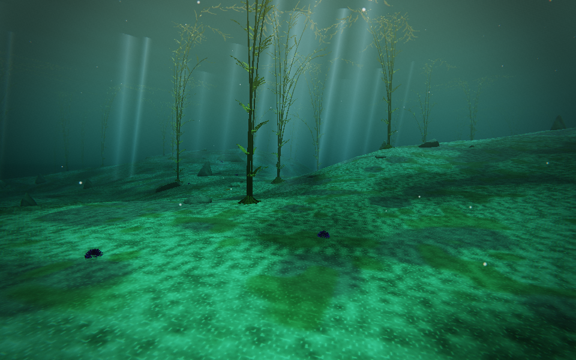 | 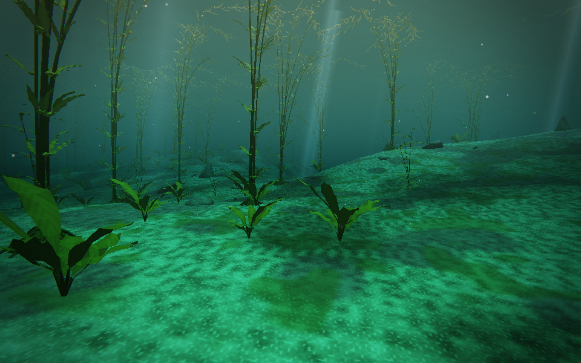 |
| 森の中層 | 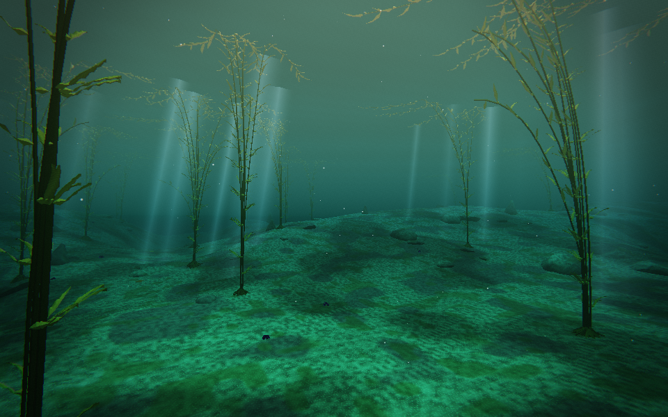 | 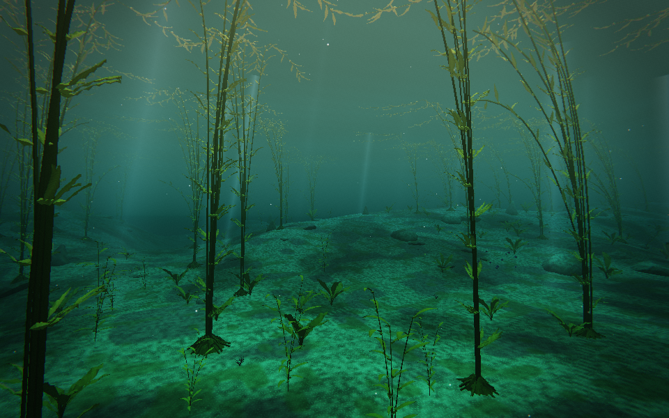 |
| 砂道と林縁 | 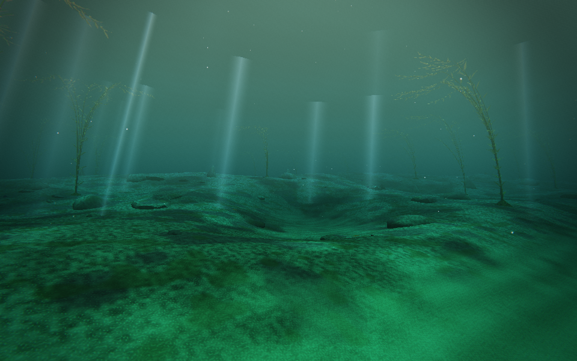 | 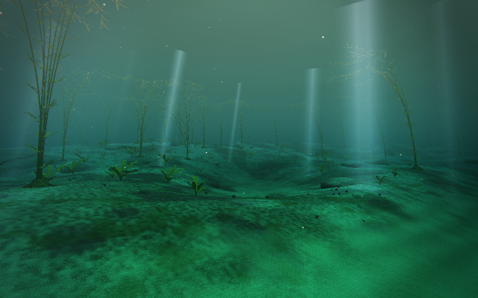 |
| 水面を見上げる | 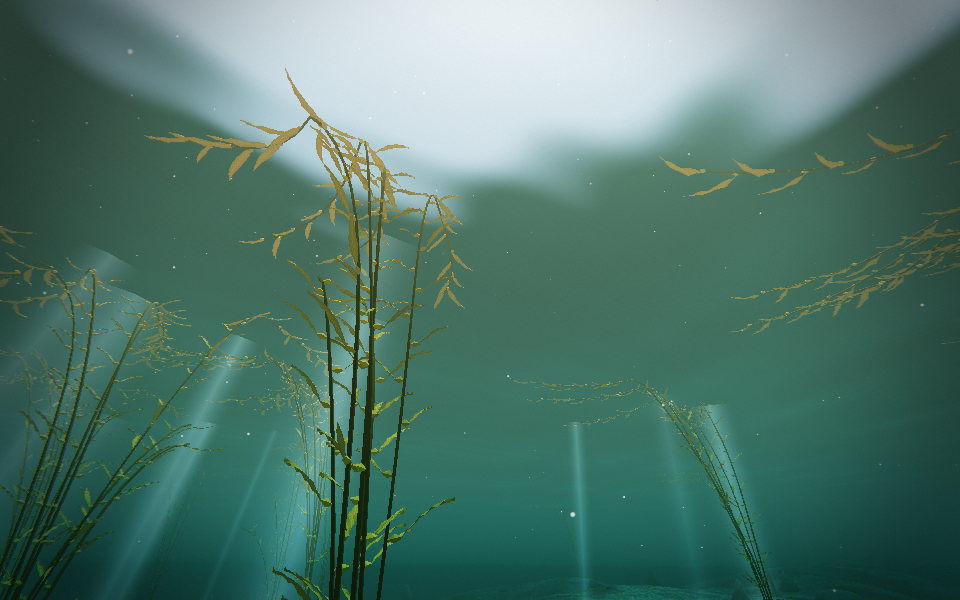 | 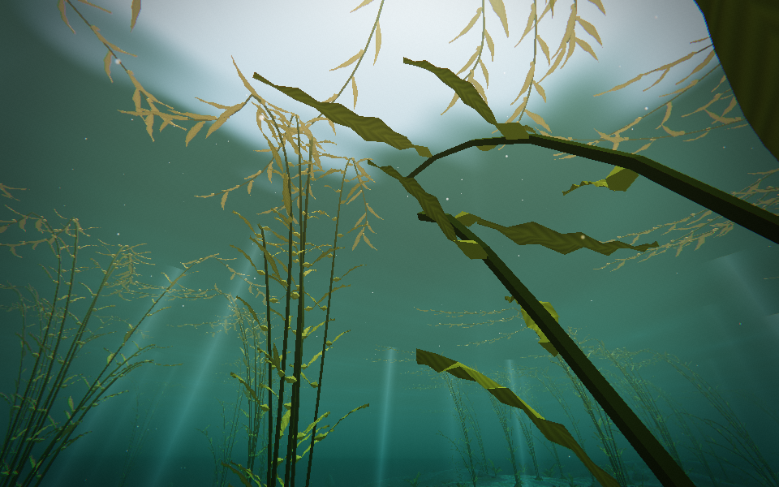 |

[標準画質の岩場](images/after-medium-rock-garden.png)でも確認しています。

## 生き物の近景と動き

| 観察 | 実アプリの画像 |
|---|---|
| 揺れる葉に付いた巻貝 | 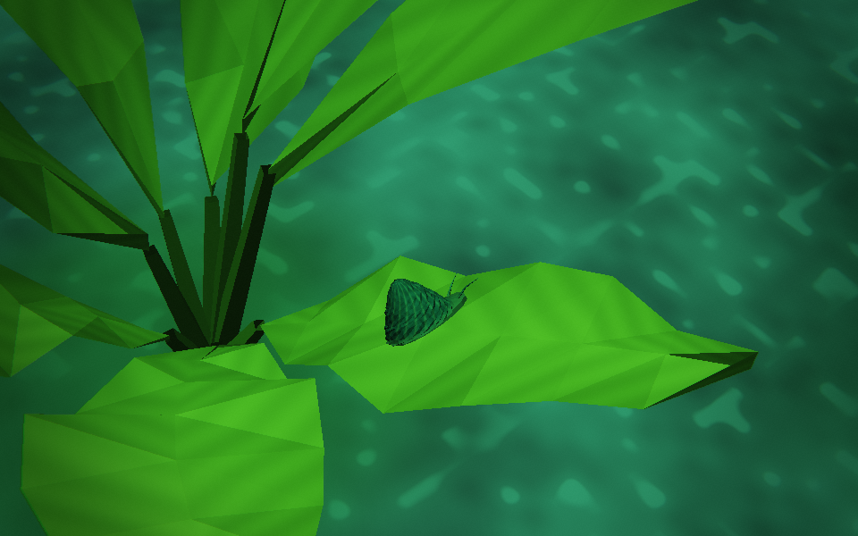 |
| セニョリータの採餌 | 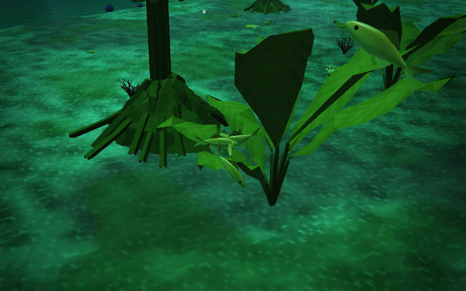 |
| 夜の砂中休息。中央付近の小さい頭だけが砂から出ている | 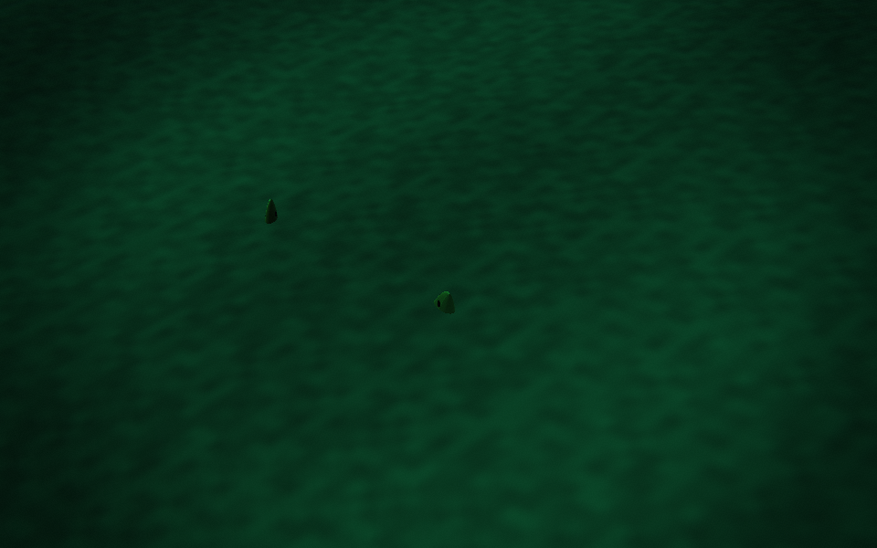 |
| 森を通るアザラシ | 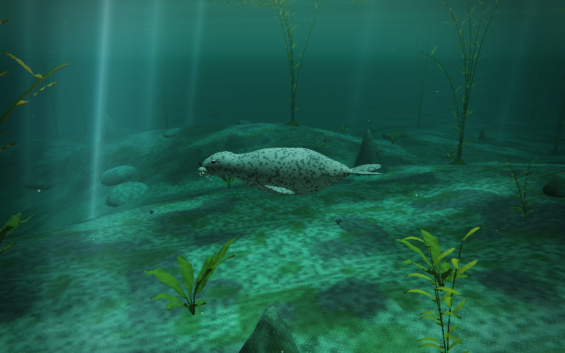 |
| 波に合わせて鼻先を出す息継ぎ | 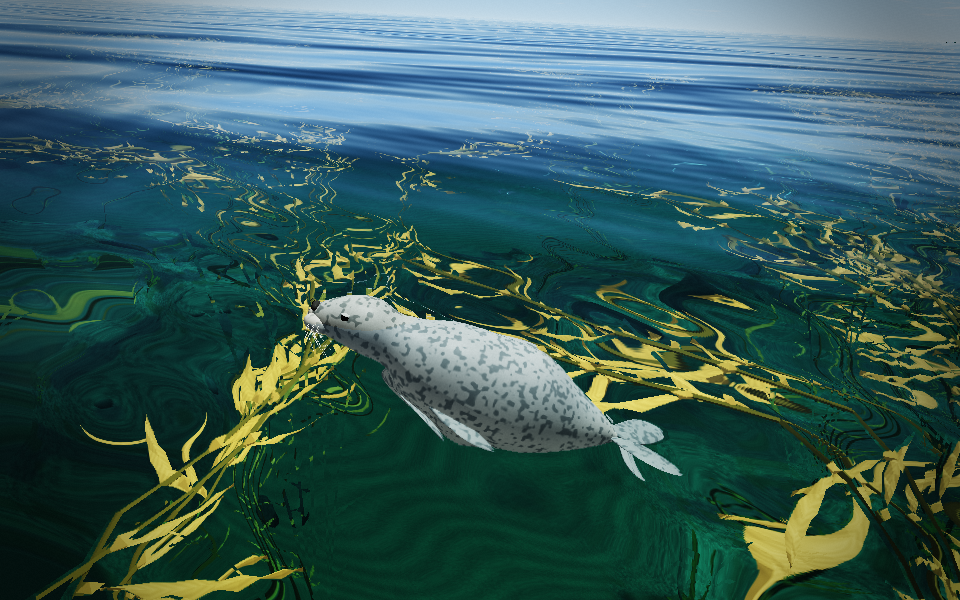 |

短い動作記録: [葉のそばの採餌・6秒](images/forest-life.mp4) / [アザラシの泳ぎ・4秒](images/seal-passing.mp4) / [息継ぎ・4秒](images/seal-breathing.mp4)。GitHubで再生されない場合はファイルをダウンロードできます。

動画は実アプリの生態・揺れを同じ0.05秒刻みで進めた連続フレームです。20fpsで書き出しており、実機の描画速度の測定ではありません。近景はモデルを拡大せずカメラの画角を狭めています。夜の画像は200秒の生態更新後の砂中休息で、露出を持ち上げていないため暗く見えます。

ほかに[イソギンチャク](images/resident-anemone.png)、[岩面のバットスター](images/resident-batStar.png)、アザラシの形状確認用の[斜め前](images/seal-studio-three-quarter.png)・[側面](images/seal-studio-side.png)・[正面](images/seal-studio-front.png)・[背面](images/seal-studio-rear.png)があります。形状確認の4枚はアプリ既存のスタジオ照明を使い、実海域の画像とは分けています。

撮影方法は [life-capture.cjs](life-capture.cjs)、各フレームの行動状態・カメラ・検証値は [魚の記録](images/fish-life-report.json)、[小動物の記録](images/small-residents-report.json)、[アザラシの記録](images/seal-studio-seal-visit-report.json)に保存しています。

## 追加したもの

| 対象 | 内容 |
|---|---|
| 成熟したケルプ | 元の380株の位置・先端を保持し、周遊近くの岩上へ113株追加。計493株 |
| 林床の海藻 | 若いケルプ196株、幅広い褐藻630株、低い枝状紅藻329株。後者2形態は種未同定 |
| 既存4種の魚 | ケルプの位置に対応した配置。セニョリータとサーフパーチは葉・岩の近くで採餌 |
| セニョリータの夜 | 各個体が平坦な砂を探して移動し、頭を残して休息。明るくなると泳ぎ出す。捕食者からの逃走も維持 |
| ウニ・バットスター | ウニ320個体の棘が動き、ヒトデ110個体が岩面に沿ってごく遅く移動 |
| 小さな住人 | 巻貝30個体（12個体は揺れる葉に追従）、イソギンチャク58個体、被覆状カイメン74個体。種名は断定しない |
| 訪問者 | ゼニガタアザラシ1頭。通過・浮上・鼻先を出す呼吸・再潜水。近くで追われている間は自然に泳ぎ続ける |
| 行き先 | 図鑑から「林床の海藻の庭」「岩陰の小さな住人」へ移動可能。アザラシは実際に近くへ来ているときに追える |

個体数・群落密度・行動のタイミングは設計値です。Point Lobosの資料に基づく代表景観であり、現在のBluefish Coveの被度・個体数を計測再現したものではありません。新たな訪問者はアザラシ1種です。ラッコや、魚同士のクリーニング行動は今後の候補です。

## 操作と見どころ

1. ポイントロボスへ入り、図鑑の「林床の海藻の庭」へ。低い葉から水面の天蓋まで見上げます。
2. 「岩陰の小さな住人」へ。葉の巻貝や小さな触手を近くで観察します。
3. 時刻を夜へ進め、セニョリータが砂へ移るまでしばらく待ちます。「会いに行く」は実際に露出した頭を追います。昼へ戻すと起床します。
4. アザラシは初回およそ60–120秒後に遠方へ入り、森の縁を通ります。通常の訪問は約220秒、次の休止は8–14分。現地の出現頻度ではありません。

開発用の `?debug` では `seaglass.lobosVisit()` で同じ安全な訪問経路を開始できます。既に来ている場合は重複して生成しません。ルートの開始点は遠いため、その場に瞬間出現はしません。

## 検証と描画量

型検査、本番ビルド、既存Point Lobos検証、新しい植生・魚・底生生物・訪問者の4検証、Point Lobosと宮古島の昼/夕/夜/朝シミュレーションを実行しました。結果は[validation](validation)に保存しています。

専用検証では、岩と砂の置き分け、海底への接地、配置再現、砂中休息からの復帰と回避、アザラシ全身の床離隔・呼吸時の鼻孔・追尾中の継続移動を確認しています。葉の支持点はCPUとGPUで同じ変形式を使うことをコードで確認し、実画像で巻貝の接地も確認しました。GPU頂点とCPU支持点の数値比較までは行っていません。

実アプリの軽量画質4視点では、提出三角形数は変更前約107–118万から変更後約156–180万、draw callは66–80から89–109へ増えました。描画パスを含む値です。新しい下層は3つの形状バッファを共有し、小動物は5メッシュ、成熟ケルプは既存の区画別LODを使います。

これはクラウドChromium / SwiftShaderでの描画確認と提出量の比較です。Windowsの実GPU・ANGLE/D3D11やスマートフォンのFPSは未測定で、採用前に普段の端末で移動中の負荷を確認してください。外部天気・フォントは通信制限下のため、比較は共通の晴天条件と代替フォントを使用しました。

再撮影方法・カメラ・描画量・例外は [capture.cjs](capture.cjs)、[変更前記録](images/before-report.json)、[変更後記録](images/after-report.json)、[標準画質記録](images/after-medium-report.json)にあります。
