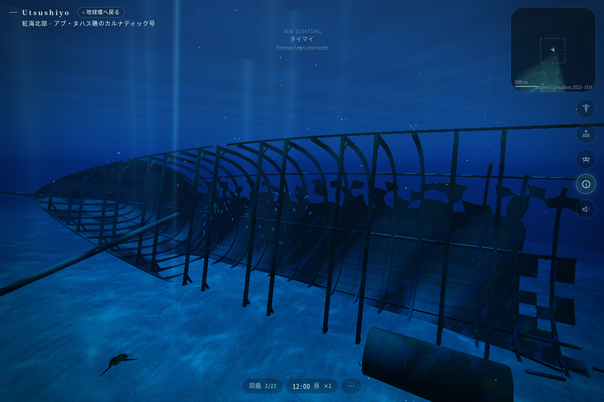
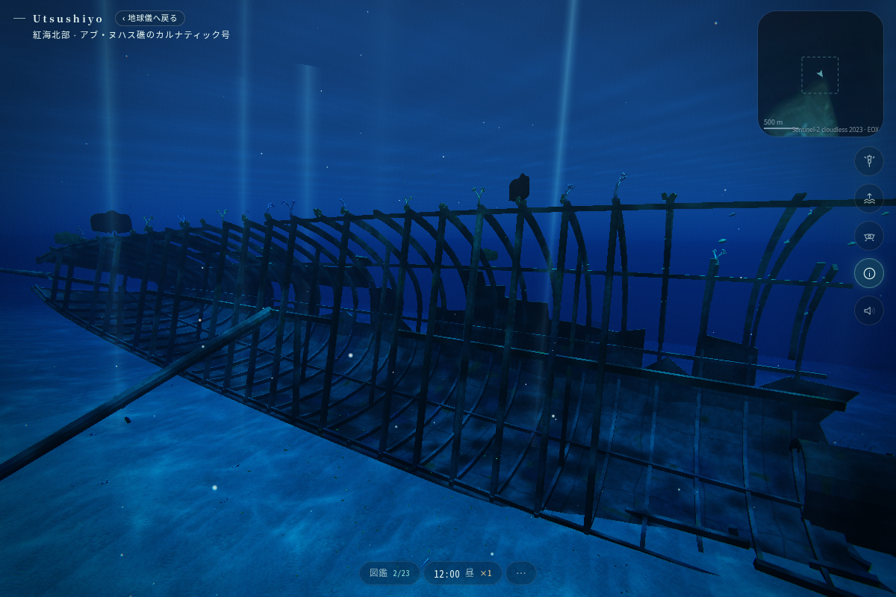
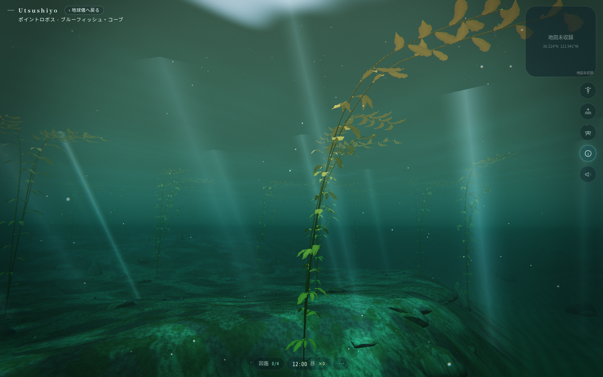

# 海の試作 — Claude 向け比較入口

ユーザーの目的は、海を静かに眺める体験の質を高め、地球の実在する美しさを感じられる世界にすることです。紅海北部の沈没船の改善と、新しい海の試作について、先行版と GPT-6 Astra・Ultra 版を比較し、良い実装または良い部分を採用してください。

このブランチの基点からの変更は比較資料のみです。各提案は未採択で、最終判断・統合は Claude に委ねます。

## 比較条件

- 4つの制作ブランチは同じ `7124cc649a881a805499eb6effa37caa49a92e3d` を開始点にしています。
- Astra の2作は `gpt-6-astra` / reasoning `ultra` を明示指定した制作エージェントが担当しました。
- Astra には元の課題・既存コード・同じ制約を渡し、先行版の実装や画像を参照せず設計するよう依頼しました。制作時間や道具の使用を統制したモデル性能評価ではありません。
- 初期制作後のレビュー指摘と、沈没船を比較するカメラ条件は共有しています。最終調整・再検証にも Astra / Ultra 指定の担当を使っています。
- 沈没船は同じ海域・日時・カメラで比較できます。新しい海は同じ課題から選定した別の場面なので、画素単位で比較するものではありません。
- カリフォルニアの2案は近い地域・同じケルプ林の環境です。まず一方を採用候補として選び、もう一方から有効な表現を取り込む進め方が適しています。

## 4つの候補

| 対象 | 先行版 | Astra・Ultra 版 |
|---|---|---|
| カルナティック号 | [実装・画像](https://github.com/ynatsume-source/3dproject/tree/codex/carnatic-wreck-detail/docs/proposals/carnatic-wreck) · `codex/carnatic-wreck-detail` | [実装・画像](https://github.com/ynatsume-source/3dproject/tree/astra/carnatic-wreck-ultra/docs/proposals/astra-carnatic) · `astra/carnatic-wreck-ultra` |
| 新しい海 | [モントレー湾](https://github.com/ynatsume-source/3dproject/tree/codex/monterey-kelp-prototype/docs/proposals/monterey-kelp) · `codex/monterey-kelp-prototype` | [ポイントロボス](https://github.com/ynatsume-source/3dproject/tree/astra/new-sea-ultra/docs/proposals/astra-new-sea) · `astra/new-sea-ultra` |

各リンク先の `README.md` と `CLAUDE_HANDOFF.md` に、制作内容・推定・検証・画像があります。未測量の地形や写真未照合の細部を、実測済みの再現として扱わないでください。

## 比較画像

沈没船の骨組み（同じ日時・指定カメラ位置）:

| 先行版 | Astra・Ultra版 |
|---|---|
|  |  |

新しい海の代表的な中層。別の海域・カメラなので、地形や構図も含む制作案として比較します。

| モントレー湾・先行版 | ポイントロボス・Astra版 |
|---|---|
|  |  |

画像は実際のブラウザ描画です。各案の近景・全景・夜間等は、それぞれの資料をご覧ください。

## 採用を決める観点

| 観点 | 画面とコードで確かめること |
|---|---|
| 海を眺める心地よさ | 遠景・中景・近景が読み取れるか。長く眺めても動きや光が落ち着いているか |
| 沈没船の形 | 船首・船尾・中央の破断部が識別でき、近づいても構造に厚みと整合性があるか |
| 海の固有性 | 既存の熱帯海域とは違う地形・色・植生・生きものの関係があるか |
| 動きと鑑賞 | 植物の動きに連続性があるか。カメラの視線・動線・衝突が破綻しないか |
| 実在する世界との関係 | 事実・推定・簡略化が区別され、生息しない生物や説明が混入していないか |
| 負荷 | 同じ実機・画質で描画時間、メモリ、draw callを比較。頂点数だけで優劣を決めない |
| 保守と統合 | 現行 main / 作業中の変更を保てるか。各変更の責務が明確か。保存や住民状態に影響がないか |

採用は部品単位でも構いません。たとえば、船体形状・付着生物・材質・撮影経路、海域地形・海藻の形・揺れ・魚・位置図を個別に評価できます。

## 補足資料

- [比較対象のコミット・検証範囲](REVIEW_SNAPSHOT.md)
- [画面と実装の観察](OBSERVATIONS.md)
- [差分の読み方・取り込み時の注意](INTEGRATION_NOTES.md)

## Claude への依頼

[CLAUDE_REVIEW_PROMPT.md](CLAUDE_REVIEW_PROMPT.md) をそのまま使えます。今回の比較資料は、進行中の作業を保護し、根拠を示して採用候補を選ぶための入口です。
